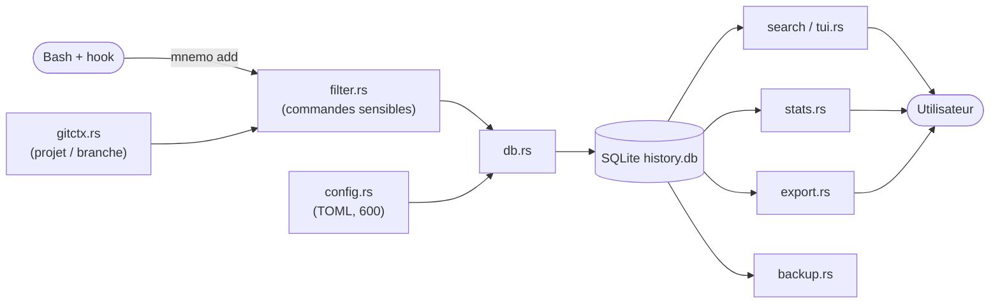
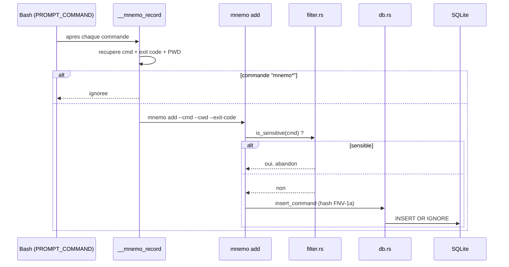
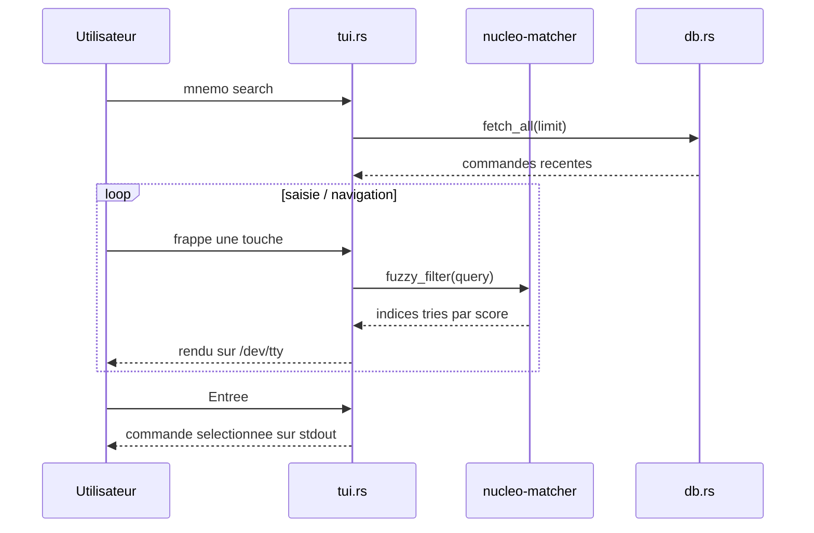
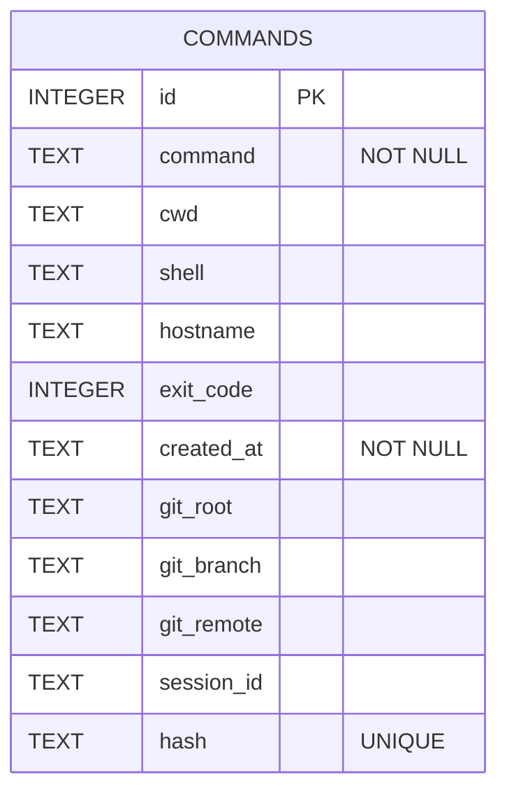
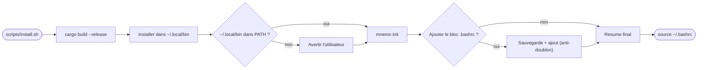
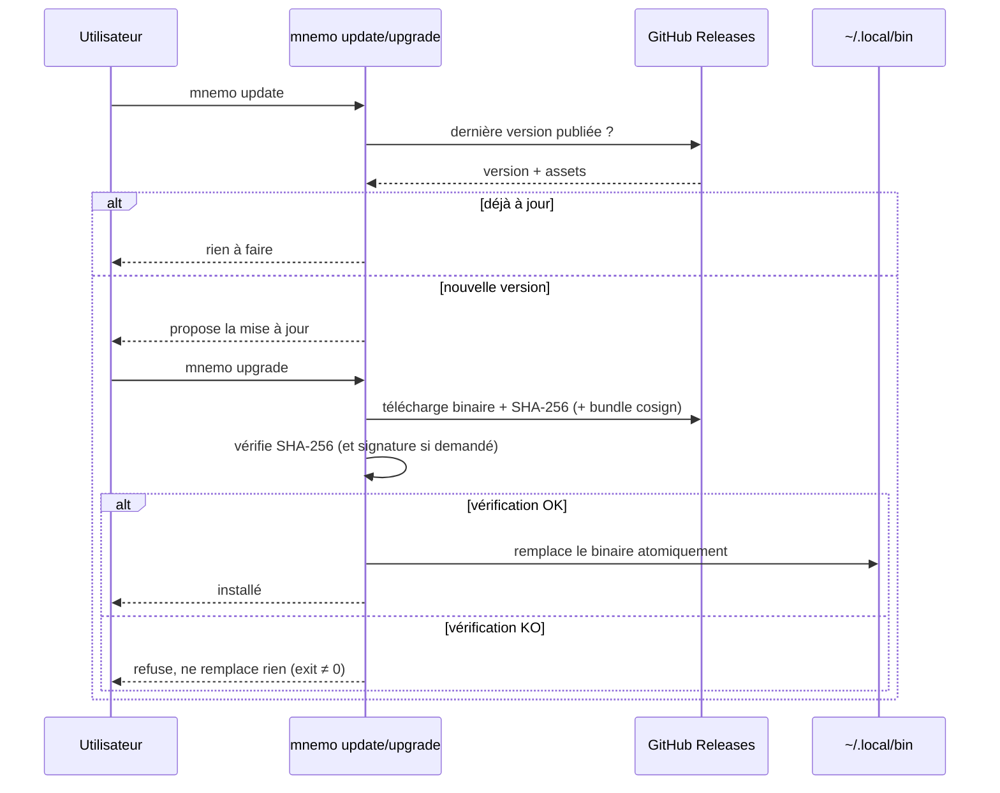
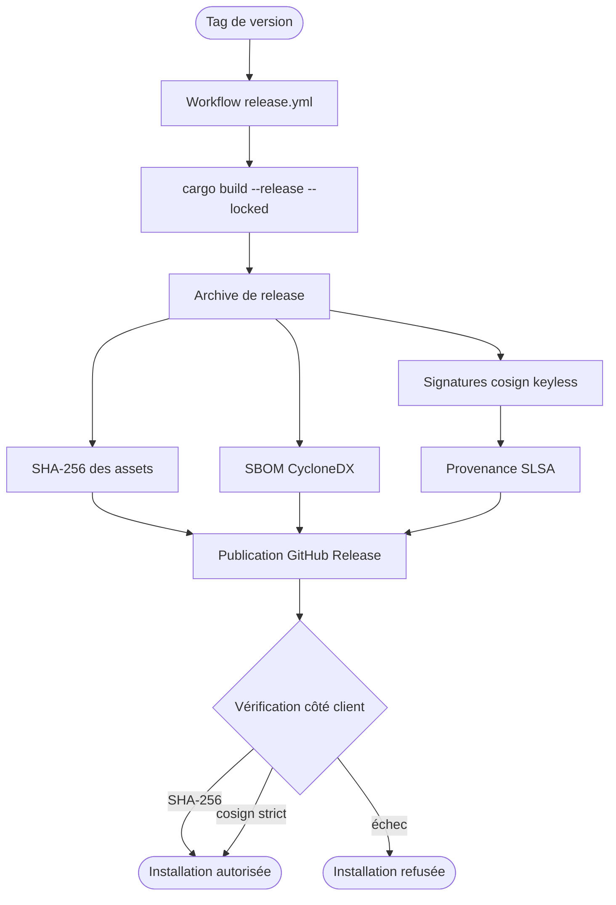
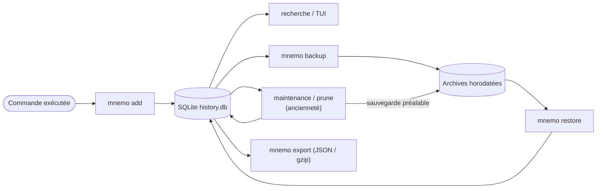

# mnemo

[](https://github.com/Vesperis-group/mnemo/actions/workflows/ci.yml)
[](https://github.com/Vesperis-group/mnemo/actions/workflows/audit.yml)
[](https://github.com/Vesperis-group/mnemo/actions/workflows/release.yml)
[](#licence)
[](rust-toolchain.toml)
[](#sécurité--confidentialité)

> Dépôt officiel : <https://github.com/Vesperis-group/mnemo>

**Assistant d'historique shell local-first** : recherche fuzzy, contexte projet
(Git), interface TUI, sauvegardes, maintenance et releases vérifiables. Un seul
binaire **Rust**, sans serveur ni cloud.

`mnemo` enregistre chaque commande exécutée dans une base **SQLite** locale, puis
la retrouve instantanément via une interface TUI « ops dashboard » ou en ligne de
commande. L'objectif : un historique fiable, contextualisé et privé, qui reste
entièrement sur votre machine.

- 🦀 Rust, un seul binaire `mnemo` (~2,3 Mo), toolchain épinglée
- 🔍 Recherche **fuzzy** interactive (`ratatui` + `crossterm` + `nucleo-matcher`)
- 🗄️ Stockage **SQLite** local (`rusqlite`), aucun réseau à l'usage
- 🧭 Contexte **projet / branche Git** attaché à chaque commande
- 🔒 Filtrage automatique des commandes sensibles, fichiers en `600`
- 💾 Sauvegardes, restauration et maintenance par ancienneté intégrées
- 🔏 Releases vérifiables : SHA-256, signatures cosign keyless, SBOM, provenance
- 🐧 Cible principale : **Linux / WSL** avec Bash
- 🤖 Mode non interactif `--print` (+ sorties JSON) pour scripts et CI

---

## Sommaire

- [Aperçu / exemple d'usage](#aperçu--exemple-dusage)
- [Installation rapide](#installation-rapide)
- [Installation manuelle](#installation-manuelle)
- [Désinstallation](#désinstallation)
- [Commandes disponibles](#commandes-disponibles)
- [Recherche avancée](#recherche-avancée)
- [Maintenance automatique](#maintenance-automatique)
- [Configuration : `mnemo config`](#configuration--mnemo-config)
- [Version : `mnemo version`](#version--mnemo-version)
- [Intégration Bash](#intégration-bash)
- [Diagnostic : `mnemo doctor`](#diagnostic--mnemo-doctor)
- [Release v0.1](#release-v01)
- [Politique de branche](#politique-de-branche)
- [Pre-commit hooks (à venir)](#pre-commit-hooks-à-venir)
- [Chemins XDG utilisés](#chemins-xdg-utilisés)
- [Sécurité & confidentialité](#sécurité--confidentialité)
- [Compatibilité](#compatibilité)
- [Compatibilité et stabilité](#compatibilité-et-stabilité)
- [Architecture & diagrammes](#architecture--diagrammes)
- [Limites connues](#limites-connues)
- [Roadmap](#roadmap)
- [Troubleshooting](#troubleshooting)
- [Développement](#développement)
- [Licence](#licence)

---

## Aperçu / exemple d'usage

Interface TUI « ops dashboard » (`mnemo search`) : barre d'identité, synthèse
(KPI), liste des commandes et panneau de détails sectionné.

```text
┌ mnemo ───────────────────────────────────────────────────────────────────────────────────────┐
│mnemo v0.9.2  ·  projet mnemo  ·  branche main  ·  total 6                                       │
│Recherche (tapez pour filtrer)▏                                                                  │
│Filtres [aucun filtre]                                                                           │
└──────────────────────────────────────────────────────────────────────────────────────────────┘
┌ Synthèse ────────────────────────────────────────────────────────────────────────────────────┐
│Total 6   Visibles 6   Succès 4   Échecs 2   Taux d'échec 33.3%   Projets 2   Shell bash         │
└──────────────────────────────────────────────────────────────────────────────────────────────┘
┌ Commandes (6) ─────────────────────────────────────────┐┌ Détails ───────────────────────────┐
│> 17:29  ✓ mnemo          cargo build --release --locked ││COMMAND                              │
│  17:24  ✓ mnemo          cargo clippy --all-targets --… ││cargo build --release --locked       │
│  17:20  ✗ mnemo          cargo test --locked            ││statut     SUCCESS                   │
│  17:18  ✓ mnemo          git push origin feat/tui       ││                                     │
│  16:58  ✓ infra          docker compose up -d           ││CONTEXT                              │
│  16:40  ✗ infra          terraform apply                ││cwd        /home/dev/mnemo           │
└────────────────────────────────────────────────────────┘└─────────────────────────────────────┘
 [Enter] sélection  [Tab] détails  [Ctrl+P/B/D] filtrer  [Ctrl+L] clear  [F1] aide  [Esc] quitter
```

> Pour une capture d'écran réelle (PNG), voir [docs/assets/README.md](docs/assets/README.md)
> qui décrit comment la générer ; aucune image binaire n'est versionnée par défaut.

Mode non interactif (scripts / CI) :

```console
$ mnemo search cargo --print
cargo build --release
cargo test
cargo clippy
```

Raccourcis principaux de la TUI :

| Touche | Action |
| --- | --- |
| *(saisie)* | filtre fuzzy en temps réel (mode recherche) |
| `↑` / `↓` ou `k` / `j` | navigation dans la liste |
| `Tab` | bascule le focus liste / détails |
| `/` | revenir au focus recherche |
| `Entrée` | imprime la commande sélectionnée sur stdout, puis quitte |
| `y` / `c` | copier la commande |
| `e` | exporter les résultats filtrés en JSON |
| `x` / `d` | supprimer (avec sauvegarde préalable) |
| `f` | statut : tous / succès / échecs |
| `Ctrl+P` / `Ctrl+B` / `Ctrl+D` | filtrer par projet / branche / dossier |
| `Ctrl+L` | effacer tous les filtres |
| `F1` / `?` | aide |
| `Esc` / `Ctrl+C` | quitter sans rien imprimer |

---

## Installation rapide

### Distante (recommandée)

Installe la **dernière release** en téléchargeant un binaire pré-compilé (aucune
toolchain Rust requise). Par défaut : binaire **musl statique**, le plus
compatible.

```bash
curl -fsSL https://raw.githubusercontent.com/Vesperis-group/mnemo/main/scripts/install.sh | bash
```

Le script :

1. détecte l'architecture (`uname -m`) et choisit l'asset adapté ;
2. télécharge l'archive `.tar.gz` **et** son `.sha256` ;
3. **vérifie l'intégrité** (SHA-256, **toujours obligatoire**) avant toute
   installation ;
4. **vérifie la signature Sigstore** de l'archive si `cosign` est présent
   (best-effort par défaut, voir ci-dessous) ;
5. installe le binaire dans `~/.local/bin/mnemo` (créé si absent) ;
5. vérifie que `~/.local/bin` est dans le `PATH` ;
6. lance `mnemo init` ;
7. **propose** d'ajouter l'intégration Bash à `~/.bashrc` (sauvegarde +
   anti-doublon) ;
8. affiche un résumé des prochaines étapes.

Choisir une **version précise** :

```bash
MNEMO_VERSION="v0.1.2" \
  bash <(curl -fsSL https://raw.githubusercontent.com/Vesperis-group/mnemo/main/scripts/install.sh)
```

Choisir une **cible précise** (musl statique, ou GNU/glibc 2.35) :

```bash
MNEMO_TARGET="x86_64-unknown-linux-gnu-glibc2.35" \
  bash <(curl -fsSL https://raw.githubusercontent.com/Vesperis-group/mnemo/main/scripts/install.sh)
```

Mode non interactif (utile en CI) :

```bash
MNEMO_ASSUME_YES=1 ... bash ...   # confirme automatiquement
MNEMO_NO_BASHRC=1  ... bash ...   # n'ajoute pas le bloc .bashrc
```

#### Vérification de signature Sigstore (optionnelle / stricte)

Le SHA-256 reste **toujours** obligatoire et bloquant. En complément
(défense en profondeur), le script vérifie aussi la **signature Sigstore** de
l'archive lorsque [`cosign`](https://docs.sigstore.dev/cosign/installation/)
est installé :

- **Par défaut (best-effort)** : si `cosign` est absent ou si le bundle de
  signature est indisponible, le script **avertit** puis **continue**, car
  l'intégrité SHA-256 a déjà été vérifiée. Une signature présente mais
  **invalide** interrompt toujours l'installation.
- **Mode strict** : `MNEMO_REQUIRE_SIGNATURE=1` rend la vérification
  obligatoire. L'installation est **refusée** si `cosign` est absent, si le
  bundle est indisponible, ou si la signature est invalide.

```bash
# Installation strictement signée (refuse si cosign absent ou signature KO)
MNEMO_REQUIRE_SIGNATURE=1 \
  bash <(curl -fsSL https://raw.githubusercontent.com/Vesperis-group/mnemo/main/scripts/install.sh)
```

> `cosign` n'est **jamais** téléchargé automatiquement (pas de `curl | bash`
> implicite). Installez-le via le gestionnaire de paquets de votre
> distribution ou `go install github.com/sigstore/cosign/v2/cmd/cosign@latest`.
> L'identité et l'émetteur OIDC attendus sont configurables via
> `MNEMO_SIGN_IDENTITY` et `MNEMO_SIGN_OIDC_ISSUER`.

### Cibles Linux disponibles

| Asset | Cas d'usage |
| --- | --- |
| `x86_64-unknown-linux-musl` | **Recommandé.** Binaire **statique**, compatible avec quasiment toutes les distributions (pas de dépendance à la glibc du système). |
| `x86_64-unknown-linux-gnu-glibc2.35` | Binaire GNU construit sur Ubuntu 22.04, pour les environnements glibc **≥ 2.35**. |

> 🧱 Les variantes `aarch64-unknown-linux-*` pourront être ajoutées
> ultérieurement (cross-compilation).

### Depuis les sources (locale)

```bash
git clone https://github.com/Vesperis-group/mnemo.git
cd mnemo
bash scripts/install.sh                       # télécharge la release
MNEMO_INSTALL_FROM_SOURCE=1 bash scripts/install.sh   # compile localement
```

Le repli `MNEMO_INSTALL_FROM_SOURCE=1` compile depuis le dépôt cloné (ou clone
`MNEMO_REPO_URL` si les sources sont absentes) au lieu de télécharger un asset.

---

## Installation manuelle

Si vous préférez tout contrôler :

```bash
# 1. Compiler
cargo build --release

# 2. Installer le binaire
mkdir -p ~/.local/bin
install -m 0755 target/release/mnemo ~/.local/bin/mnemo

# 3. S'assurer que ~/.local/bin est dans le PATH (si nécessaire)
echo 'export PATH="$HOME/.local/bin:$PATH"' >> ~/.bashrc

# 4. Initialiser config + base
mnemo init

# 5. Copier le snippet d'intégration affiché par :
mnemo bashrc
# ... et le coller dans ~/.bashrc, puis :
source ~/.bashrc
```

Avec le `Makefile` :

```bash
make release     # compilation optimisée
make install     # délègue à scripts/install.sh
```

---

## Désinstallation

```bash
bash scripts/uninstall.sh
```

Le script :

1. supprime `~/.local/bin/mnemo` s'il existe ;
2. **propose** de retirer le bloc mnemo de `~/.bashrc` (après sauvegarde) ;
3. **propose** de supprimer les données locales (`~/.config/mnemo`,
   `~/.local/share/mnemo`).

> 🔒 Les données ne sont **jamais** supprimées sans confirmation explicite.

Options :

```bash
MNEMO_ASSUME_YES=1 bash scripts/uninstall.sh   # confirme bin + .bashrc (PAS les données)
MNEMO_PURGE=1      bash scripts/uninstall.sh   # supprime aussi les données
```

Ou via le `Makefile` :

```bash
make uninstall
```

---

## Mise à jour et désinstallation (intégrées)

Depuis la v0.5, mnemo gère lui-même son cycle de vie, sans dépendre des scripts
shell.

### `mnemo update` - y a-t-il du nouveau ?

```bash
mnemo update                 # compare version installée et dernière release
mnemo update --json          # sortie machine (vérification seule)
mnemo update --upgrade       # enchaîne l'upgrade si une mise à jour existe
mnemo update --upgrade --yes # idem, sans confirmation (automatisation)
```

Interroge l'API GitHub Releases (pré-releases ignorées) et affiche la version
installée, la dernière version et si une mise à jour est disponible.

**En terminal interactif**, lorsqu'une mise à jour est disponible, `mnemo update`
propose de l'installer immédiatement :

```text
Mise à jour disponible ✓
Installer maintenant avec `mnemo upgrade` ? [o/N]
```

La réponse par défaut (`Entrée`) est **non** ; répondre `o`/`oui`/`y`/`yes`
enchaîne directement `mnemo upgrade` (vérification SHA-256, sauvegarde et
remplacement atomique, sans seconde confirmation). **En mode non interactif**
(CI, script, cron, pipe) ou avec `--json`, `update` reste une simple
vérification et n'installe **rien** : il se contente d'indiquer `Lancez
`mnemo upgrade` pour l'installer.`

L'option `--upgrade` lance l'installation sans poser la question de `update` ;
sans `--yes`, c'est `mnemo upgrade` qui demande sa confirmation finale (un seul
prompt). `--upgrade --yes` permet un upgrade entièrement automatisé. Aucune
installation n'a lieu sans consentement. Le drapeau `--require-signature` est
transmis tel quel à `mnemo upgrade` (voir ci-dessous).

Exemple JSON :

```json
{
  "current_version": "v0.4.0",
  "latest_version": "v0.5.0",
  "update_available": true,
  "asset_target": "x86_64-unknown-linux-musl"
}
```

### `mnemo upgrade` - installer la dernière version

```bash
mnemo upgrade                 # dernière version stable (confirmation demandée)
mnemo upgrade --yes           # sans question
mnemo upgrade --dry-run       # montre ce qui serait fait, n'installe rien
mnemo upgrade --version v0.5.0 # version précise
mnemo upgrade --target aarch64-unknown-linux-musl
mnemo upgrade --require-signature # exige une signature Sigstore valide
```

Déroulé : téléchargement de l'archive **et** de son `.sha256`, **vérification
SHA-256 avant extraction** (toujours obligatoire), **vérification de la
signature Sigstore** lorsque `cosign` est présent, contrôle que le nouveau
binaire répond, sauvegarde automatique des données, puis remplacement
**atomique** de `~/.local/bin/mnemo`.

La signature Sigstore suit la même logique que `install.sh` : best-effort par
défaut (avertissement si `cosign` est absent ou si le bundle est indisponible,
l'intégrité SHA-256 ayant déjà été vérifiée), **strict** avec
`--require-signature` (l'upgrade est refusé si la signature ne peut pas être
vérifiée). Une signature présente mais invalide refuse **toujours** l'upgrade.

> 🔒 `upgrade` ne touche **jamais** à `history.db`, `config.toml` ni aux
> sauvegardes. HTTPS et SHA-256 sont obligatoires ; aucun script distant n'est
> exécuté ; `cosign` n'est jamais téléchargé automatiquement. En cas d'échec,
> le binaire en place reste intact.

### `mnemo uninstall` - retirer mnemo

```bash
mnemo uninstall              # demande confirmation, puis retire binaire + bloc .bashrc
mnemo uninstall --yes        # sans question (CI/script), GARDE les données
mnemo uninstall --dry-run    # aperçu sans rien modifier
mnemo uninstall --purge      # supprime AUSSI config, base et sauvegardes (confirmation forte)
mnemo uninstall --purge --yes
```

`uninstall` est désormais **toujours protégé par une confirmation** : retirer le
binaire et l'intégration shell reste une action destructive. En interactif, une
question est posée (`Désinstaller mnemo tout en conservant les données ? [y/N]`) ;
en mode non interactif **sans `--yes`**, la commande refuse proprement avec un
code de sortie non nul et le message *« Confirmation requise. Relancez avec
--yes pour confirmer ou --dry-run pour prévisualiser. »*

Par défaut, `uninstall` retire le binaire et le bloc d'intégration `.bashrc`
(après sauvegarde) mais **conserve toutes les données**. Avec `--purge`, une
sauvegarde de sécurité est créée hors du dossier de données, puis config, base
et sauvegardes sont supprimées **après confirmation forte** ; en mode non
interactif, `--purge` exige aussi `--yes`.

> `--dry-run` ne supprime **jamais** rien, et aucune donnée n'est touchée sans
> `--purge`.

---

## Commandes disponibles

| Commande | Description |
| --- | --- |
| `mnemo init` | Crée `~/.config/mnemo/config.toml`, `~/.local/share/mnemo/history.db` et affiche le snippet `.bashrc`. |
| `mnemo import [--file <chemin>]` | Importe `~/.bash_history` (ou un fichier donné) dans SQLite. |
| `mnemo add --cmd "<cmd>" [--cwd "<dir>"] [--exit-code <n>]` | Ajoute une commande dans la base. |
| `mnemo tui [requête] [--project <nom>] [--branch <branche>] [--cwd <chemin>] [--failed]` | Ouvre la **TUI avancée** (recherche, filtres, détails, suppression). |
| `mnemo search [requête]` | Ouvre la même TUI interactive ; la commande choisie est imprimée sur stdout. |
| `mnemo search <requête> --print [--limit N]` | **Mode non interactif** : imprime les résultats sur stdout, sans TUI. |
| `mnemo search --query <requête> --print` | Variante avec option explicite `--query`. |
| `mnemo search <requête> [--project <nom>] [--branch <branche>] [--exit-code <n>] [--failed] [--since <durée\|date>] [--before <date>] [--cwd <chemin>] [--shell <shell>] [--limit N] [--json]` | **Recherche avancée** : filtres combinables par contexte Git, code de sortie, date, répertoire, shell ; sortie JSON stable avec `--print --json`. |
| `mnemo bashrc` | Affiche uniquement le snippet d'intégration Bash. |
| `mnemo migrate` | Applique les migrations de schéma SQLite en attente (idempotent, non destructif). |
| `mnemo stats [--project <nom>] [--branch <branche>] [--since <durée\|date>] [--json]` | Statistiques d'usage enrichies (totaux, taux d'échec, top commandes/dossiers/projets/shells, activité quotidienne), filtrables (dont `--project current`) et exportables en JSON. |
| `mnemo project <current\|list>` | Affiche le projet courant (racine Git, marqueur de projet ou dossier) ou la liste des projets connus. |
| `mnemo maintenance <status\|run>` | État du nettoyage automatique ; `run --dry-run` simule, `run --yes` applique (désactivé par défaut, sauvegarde avant purge). |
| `mnemo config <show\|path\|edit\|validate>` | Affiche, localise, édite (`$EDITOR`, sauvegarde automatique) ou valide la configuration. |
| `mnemo config stats-ignore <add\|remove\|list> [<cmd>]` | Gère les commandes exclues du « Top commandes » dans `mnemo stats`. |
| `mnemo list [--limit N] [--project <nom>] [--branch <branche>] [--json]` | Affiche les dernières commandes avec leurs IDs (utile pour `mnemo delete`). |
| `mnemo backup [--output <dossier>] [--json]` | Crée une sauvegarde locale complète (`.tar.gz`). |
| `mnemo restore <archive> [--dry-run] [--yes]` | Restaure une sauvegarde après vérification, avec backup de sécurité. |
| `mnemo export --format <json\|csv> [--project <nom>] [--branch <branche>] [--output <fichier>] [--gzip]` | Exporte les commandes (stdout par défaut) ; `--gzip` produit un `.json.gz` / `.csv.gz`. |
| `mnemo delete <id> [--dry-run] [--yes]` | Supprime une commande par ID (confirmation + backup automatique). |
| `mnemo prune --older-than <durée> [--project <nom>] [--branch <branche>] [--dry-run] [--yes]` | Nettoie les commandes anciennes (`30d`, `12w`, `6m`, `1y`). |
| `mnemo doctor [--fix] [--json]` | Diagnostique l'installation et, avec `--fix`, répare les éléments manquants. |
| `mnemo version` | Affiche la version, la cible (OS/arch), le profil de build et le chemin du binaire. |
| `mnemo update [--json] [--upgrade] [--yes] [--require-signature]` | Vérifie si une nouvelle version est disponible. En terminal interactif, propose l'installation immédiate ; `--upgrade` enchaîne `mnemo upgrade` (avec `--yes` pour l'automatisation, `--require-signature` transmis tel quel). Sans terminal ou avec `--json`, n'installe **rien**. |
| `mnemo upgrade [--dry-run] [--yes] [--version <vX.Y.Z>] [--target <triplet>] [--require-signature]` | Télécharge et installe la dernière version (vérif. SHA-256 obligatoire, signature Sigstore best-effort ou stricte via `--require-signature`, remplacement atomique). |
| `mnemo uninstall [--dry-run] [--yes] [--purge]` | Désinstalle mnemo. **Conserve les données** sauf `--purge`. |

Le mode `--print` garde le comportement TUI **par défaut** (sans `--print`).

## TUI avancée

`mnemo tui` est l'interface interactive principale. `mnemo search` (sans
`--print`) utilise le même moteur ; `mnemo search --print` reste un mode
non interactif inchangé.

```bash
mnemo tui                        # toutes les commandes
mnemo tui cargo                  # requête initiale
mnemo tui --project mnemo        # filtre projet initial
mnemo tui --branch main          # filtre branche initial
mnemo tui --cwd /home/killian/mnemo
mnemo tui --failed               # uniquement les commandes en échec
```

### Quatre zones (dashboard ops)

- **Barre de commande** (haut) : badges d'identité (`mnemo` + version + projet +
  branche + total), barre de recherche (frappe en direct), puces de filtres
  actifs (`[projet: …]`, `[branche: …]`, `[statut: échecs]`, `[dossier: …]` ou
  `[aucun filtre]`).
- **Synthèse / KPI** : `Total`, `Visibles`, `Succès`, `Échecs`, `Taux d'échec`,
  `Projets` et shell dominant (masquée sur terminal court).
- **Corps** : liste des commandes (heure, statut `✓`/`✗`, contexte projet/dossier,
  commande tronquée) à gauche ; détails de la sélection à droite, organisés en
  sections **COMMAND / CONTEXT / EXECUTION / GIT / METADATA** (masqué sur
  terminal étroit).
- **Pied** : raccourcis essentiels et message de statut.

L'affichage est **responsive** : la synthèse et le panneau de détails se
masquent automatiquement sur les petits terminaux, sans jamais paniquer.

### Deux contextes de saisie

- **Search** (par défaut) : la frappe édite la requête (recherche fuzzy en
  direct).
- **Details** : focus liste, raccourcis d'une lettre actifs (`j`/`k`, `/`,
  `x`/`d`, `r`, `f`, `F`, `p`, `b`, `y`/`c`, `e`, `?`, `q`).

`Tab` bascule entre les deux. `Esc` quitte partout. `F1` ouvre l'aide partout.

### Raccourcis

| Touche | Action |
| --- | --- |
| `↑` / `k`, `↓` / `j` | élément précédent / suivant |
| `PageUp` / `PageDown` | page précédente / suivante |
| `Home` / `End` | premier / dernier élément |
| `Entrée` | imprime la commande sélectionnée puis quitte |
| `Esc` / `q` | quitter |
| `Tab` | basculer le focus liste/détails |
| `/` | revenir au focus recherche (depuis la liste) |
| `r` | rafraîchir (recharge la base) |
| `y` / `c` | copier la commande (presse-papiers système si dispo, sinon tampon interne) |
| `e` | exporter les résultats filtrés en JSON (`mnemo-export-<ts>.json`) |
| `?` / `F1` | afficher/masquer l'aide |
| `x` / `d` | supprimer la commande sélectionnée |
| `y` / `n` (`Esc`) | confirmer / annuler la suppression |
| `f` | faire défiler le statut (tous → succès → échecs) |
| `p` / `b` | filtrer par le projet / la branche courant(e) |
| `F` | ouvrir/fermer le panneau de filtres |
| `Ctrl+P` / `Ctrl+B` / `Ctrl+D` | filtrer par projet / branche / dossier de la sélection |
| `Ctrl+L` | effacer tous les filtres |
| `Ctrl+C` | quitter (dans tous les modes) |

Dans le panneau de filtres (`F`) : `p`/`b`/`w` (projet/branche/dossier depuis la
sélection), `s` (statut : tous → succès → échecs), `c` (effacer).

> **Note :** `Ctrl+C` quitte toujours l'application, quel que soit le mode.
> Le filtre « par répertoire de la sélection » est sur `Ctrl+D`.

### Copie (`c`) sans dépendance graphique

La copie tente, dans l'ordre, `wl-copy`, `xclip`, puis `xsel`. Si aucun n'est
disponible (WSL minimal, headless…), un message l'indique et la commande reste
récupérable via `Entrée`. Aucune bibliothèque de presse-papiers n'est liée au
binaire.

### Suppression sûre

`d` ouvre une confirmation : `Supprimer la commande #N ? Cette action créera
d'abord une sauvegarde.` Sur `y`, mnemo crée une **sauvegarde automatique**
(comme `mnemo delete`), supprime dans une transaction SQLite, retire l'entrée de
la liste et affiche un message de succès. **Si la sauvegarde échoue, rien n'est
supprimé.** `n` ou `Esc` annule.

### États gérés

Base absente (propose `mnemo init`), base vide, recherche/filtre sans résultat,
erreur SQLite (message propre), terminal trop petit (avertissement).

### Contexte Git et statistiques

Depuis la v0.2, chaque commande ajoutée via `mnemo add` est enrichie du contexte
Git de son répertoire (racine du dépôt, branche, remote `origin`) **lorsque
disponible**. Git reste **optionnel** : hors dépôt, ou si Git est absent, ces
champs valent `NULL` et rien ne change.

```bash
# Recherche filtrée par projet (nom du dossier racine Git ou chemin git_root)
mnemo search docker --project mnemo
mnemo search cargo --branch main
mnemo search --print --project mnemo

# Statistiques d'usage (texte)
mnemo stats

# Statistiques filtrées par projet / branche
mnemo stats --project mnemo
mnemo stats --branch main
mnemo stats --project mnemo --branch main

# Statistiques au format JSON (scripts / CI)
mnemo stats --json
```

#### Normalisation des « Top commandes »

Le « Top commandes » compte le **programme réellement invoqué**, pas le premier
mot brut de la ligne. La normalisation :

- ignore les lignes vides, les commentaires (`# …`) et les tokens parasites
  (`-`, `|`, `&&`, `;`, `then`, `fi`, `done`, `function`…) ;
- retire les affectations de variables en tête
  (`RUST_LOG=debug cargo test` → `cargo`) ;
- traverse les wrappers `sudo`, `env`, `command`, `builtin`, `exec`, `time`,
  `nohup` (`sudo -E apt update` → `apt`, `time cargo test` → `cargo`) ;
- réduit les chemins au binaire (`/usr/bin/git status` → `git`,
  `./target/release/mnemo doctor` → `mnemo`).

Les entrées écartées sont comptées et affichées :
`Entrées ignorées dans le Top commandes : X`.

Exemple de sortie nettoyée :

```text
Top commandes :
      5  echo
      3  cargo
      2  apt
      2  git
      1  docker
      1  kubectl
      1  npm
      1  npx
  Entrées ignorées dans le Top commandes : 4
```

Exemple `mnemo stats --json` :

```json
{
  "total_commands": 1166,
  "git_projects": 1,
  "failed_commands": 0,
  "ignored_for_top_commands": 192,
  "ignored_commands_config": ["create_dir"],
  "filters": { "project": "mnemo", "branch": null },
  "top_commands": [
    { "name": "cargo", "count": 12 },
    { "name": "git", "count": 8 }
  ],
  "top_directories": [
    { "path": "/home/killian/mnemo", "count": 5 }
  ],
  "top_projects": [
    { "name": "mnemo", "count": 3 }
  ]
}
```

#### Ignorer des commandes dans les statistiques

Certaines commandes (helpers de scripts, alias internes…) polluent le « Top
commandes » sans intérêt analytique. Vous pouvez les exclure **sans supprimer**
de données : elles restent en base et dans le total, mais sont comptées comme
« Entrées ignorées » au lieu d'apparaître dans le Top.

La liste vit dans `~/.config/mnemo/config.toml`, section `[stats]` :

```toml
[stats]
ignored_commands = ["create_dir", "export"]
```

La comparaison est **exacte et insensible à la casse**, appliquée au nom
*normalisé* de la commande (`create_dir foo` → `create_dir`). Le filtre n'agit
que sur le « Top commandes » ; les totaux globaux restent inchangés.

Gérez la liste sans éditer le fichier à la main :

```bash
mnemo config stats-ignore add create_dir     # ajoute (idempotent, pas de doublon)
mnemo config stats-ignore list               # affiche la liste
mnemo config stats-ignore remove create_dir  # retire
```

`mnemo doctor` affiche également un rappel des commandes ignorées
(`Commandes ignorées dans stats : create_dir, …`), et `mnemo stats --json`
expose la liste via le champ `ignored_commands_config`.

Le schéma SQLite est versionné (`PRAGMA user_version`). Les bases existantes sont
migrées automatiquement et **sans perte** au premier usage ; `mnemo migrate`
permet de déclencher la migration explicitement, et `mnemo doctor` affiche la
version de schéma courante / attendue.


---

## Gestion des données

mnemo fournit des commandes sûres pour **sauvegarder, restaurer, exporter et
nettoyer** l'historique. Toutes les données restent **locales** (aucun cloud,
aucune synchronisation) : la base SQLite et la configuration ne quittent jamais
la machine.

### Garanties de sécurité

Toute opération destructive (`delete`, `prune`, `restore`) respecte les mêmes
règles :

- **`--dry-run`** : affiche ce qui serait touché sans rien modifier ;
- **aperçu systématique** : la (les) commande(s) concernée(s) sont affichées
  avant action ;
- **confirmation obligatoire** : sans `--yes`, une confirmation interactive est
  demandée. En mode **non interactif** (script, pipe), l'opération est
  **refusée** sans `--yes` - jamais de suppression silencieuse ;
- **sauvegarde automatique** : un backup complet est créé avant toute
  suppression ou restauration réelle ;
- **transactions SQLite** pour `delete` / `prune` / `restore`.

### Sauvegarde et restauration

```bash
mnemo backup                       # archive dans ~/.local/share/mnemo/backups/
mnemo backup --output ~/backups    # dossier de destination personnalisé
mnemo backup --json                # sortie JSON (chemin + métadonnées)

mnemo restore ./mnemo-backup-YYYYMMDD-HHMMSS.tar.gz --dry-run
mnemo restore ./mnemo-backup-YYYYMMDD-HHMMSS.tar.gz          # confirmation interactive
mnemo restore ./mnemo-backup-YYYYMMDD-HHMMSS.tar.gz --yes    # sans question
```

Une sauvegarde est une archive `.tar.gz` autonome contenant `history.db`,
`config.toml` et un `metadata.json` (version mnemo, date ISO, chemins, taille
de la base, nombre de commandes, version de schéma). La restauration **valide**
l'archive (base ouvrable, table `commands`, version de schéma compatible) et
**crée d'abord un backup de l'état courant** avant de remplacer la base et la
config.

### Export

```bash
mnemo export --format json
mnemo export --format csv
mnemo export --format json --output ./mnemo-export.json
mnemo export --project mnemo --format json
mnemo export --branch main --format csv
```

L'export JSON produit un tableau d'objets (tous les champs : `id`, `command`,
`cwd`, `shell`, `hostname`, `exit_code`, `created_at`, `git_root`, `git_branch`,
`git_remote`, `session_id`). L'export CSV respecte la RFC 4180 (échappement des
virgules, guillemets et sauts de ligne). Sans `--output`, l'export va sur
stdout. Les filtres `--project` / `--branch` s'appliquent comme pour `search`.

Les sorties sur stdout (`export`, `list`, `stats`) peuvent être enchaînées avec
les outils Unix habituels sans déclencher d'erreur « Broken pipe » : mnemo
s'arrête alors silencieusement.

```bash
mnemo export --format json | head -20
mnemo export --format csv | head -5
mnemo export --format json | jq '.[0]'
mnemo list --limit 100 | less

# Pour conserver l'export complet dans un fichier puis l'inspecter :
mnemo export --format json --output mnemo-export.json
head -20 mnemo-export.json
```


### Lister et supprimer

```bash
mnemo list                  # 20 dernières commandes avec leurs IDs
mnemo list --limit 20
mnemo list --project mnemo
mnemo list --branch main
mnemo list --json

mnemo delete 123 --dry-run  # montre la commande sans la supprimer
mnemo delete 123            # confirmation interactive + backup automatique
mnemo delete 123 --yes      # suppression directe
```

`mnemo list` affiche `id`, date courte, projet/dossier, `exit_code` et la
commande - pratique pour repérer l'ID à passer à `mnemo delete`.

### Nettoyage par ancienneté

```bash
mnemo prune --older-than 180d --dry-run
mnemo prune --older-than 30d --yes
mnemo prune --project mnemo --older-than 90d --dry-run
```

Durées acceptées : `30d` (jours), `12w` (semaines), `6m` (mois ≈ 30 jours),
`1y` (année ≈ 365 jours). En `--dry-run`, mnemo affiche le nombre d'entrées
concernées et quelques exemples. Les filtres `--project` / `--branch` sont
respectés. Un backup automatique est créé avant toute suppression réelle.


---

## Recherche avancée

`mnemo search --print` accepte des filtres **combinables** pour interroger
finement l'historique, sans TUI (idéal pour scripts et CI) :

```bash
mnemo search --print --failed                 # uniquement les commandes en échec
mnemo search --print --exit-code 127          # code de sortie exact
mnemo search docker --print --since 7d        # 7 derniers jours (durée)
mnemo search --print --since 2026-01-01       # depuis une date (AAAA-MM-JJ)
mnemo search --print --before 2026-06-01      # avant une date
mnemo search --print --cwd /home/killian/mnemo
mnemo search --print --shell bash
mnemo search --print --project current        # projet du dossier courant
mnemo search cargo --print --branch main --limit 50
mnemo search --print --json                   # sortie JSON stable
```

- `--since` accepte une **durée** (`7d`, `2w`, `3m`, `1y`) ou une **date**
  `AAAA-MM-JJ` ; `--before` attend une date. Une valeur de date **invalide**
  n'interrompt pas la commande (le filtre est simplement ignoré, avec un
  avertissement).
- `--failed` et `--exit-code` sont mutuellement exclusifs.
- `--project current` détecte automatiquement le projet du répertoire courant
  (racine Git, marqueur de projet, ou nom du dossier).
- `--json` (avec `--print`) produit un tableau d'objets au **format stable**
  (mêmes champs que `mnemo export --format json`).

Tous ces filtres sont également disponibles dans la **TUI** via les raccourcis
(`f` statut, `p`/`b` projet/branche courant, `Ctrl+P/B/D` depuis la sélection).


---

## Maintenance automatique

mnemo peut **nettoyer périodiquement** les commandes anciennes, de façon
**opt-in** et toujours protégée. La configuration vit dans la section
`[maintenance]` de `~/.config/mnemo/config.toml` :

```toml
[maintenance]
auto_prune_enabled = false       # désactivé par défaut
auto_prune_after = "180d"        # ancienneté au-delà de laquelle purger
auto_backup_before_prune = true  # sauvegarde complète avant toute purge
```

```bash
mnemo maintenance status         # affiche la config et le nombre d'entrées éligibles
mnemo maintenance run --dry-run  # simule : montre ce qui serait supprimé, ne touche rien
mnemo maintenance run --yes      # applique la purge (sauvegarde d'abord si configuré)
```

Garanties :

- **Désactivé par défaut** : `mnemo maintenance run` ne supprime jamais rien
  tant que `auto_prune_enabled = false`.
- **Jamais de suppression silencieuse** : `run` exige `--yes` (ou une
  confirmation interactive) ; `--dry-run` ne modifie jamais la base.
- **Sauvegarde avant purge** : si `auto_backup_before_prune = true`, un backup
  complet est créé avant toute suppression réelle.
- `auto_prune_after` accepte les mêmes durées que `mnemo prune`
  (`30d`, `12w`, `6m`, `1y`).


---

## Configuration : `mnemo config`

```bash
mnemo config show        # affiche la configuration effective (TOML)
mnemo config path        # chemin du fichier config.toml
mnemo config edit        # ouvre $EDITOR (repli nano/vi), avec sauvegarde préalable
mnemo config validate    # valide la config (code 1 si erreur)
```

`mnemo config edit` crée une configuration par défaut si elle est absente,
**sauvegarde** systématiquement l'ancienne version
(`config.toml.bak.AAAAMMJJ-HHMMSS`) avant d'ouvrir l'éditeur, puis **revalide**
le résultat. `mnemo config validate` signale les erreurs (par ex.
`search_limit = 0`, `auto_prune_after` illisible) et les avertissements (clés
inconnues). La configuration n'est **jamais** écrasée sans sauvegarde.


---

## Version : `mnemo version`

La commande `mnemo version` donne un aperçu complet du binaire en cours
d'exécution, pratique pour les rapports de bug et la vérification d'installation :

```console
$ mnemo version
mnemo 0.1.0
  cible   : linux/x86_64
  profil  : release
  binaire : /home/<user>/.local/bin/mnemo
```

| Champ | Source |
| --- | --- |
| version | `CARGO_PKG_VERSION` (champ `version` du `Cargo.toml`) |
| cible | `std::env::consts::OS` / `std::env::consts::ARCH` |
| profil | `debug` ou `release` (`cfg!(debug_assertions)`) |
| binaire | `std::env::current_exe()` |

---

## Intégration Bash

`mnemo init` (ou `mnemo bashrc`) fournit le bloc à coller dans `~/.bashrc`.
`scripts/install.sh` peut l'ajouter automatiquement, encadré par :

```bash
# >>> mnemo init >>>
...   # snippet généré par `mnemo bashrc`
# <<< mnemo init <<<
```

Le snippet :

- branche `__mnemo_record` sur `PROMPT_COMMAND` pour enregistrer chaque commande
  (avec son code de sortie et le répertoire courant) ;
- **n'enregistre jamais** la commande `mnemo` elle-même ;
- remappe `Ctrl+R` pour ouvrir la recherche TUI et insérer la commande choisie.
  La TUI s'affiche sur `/dev/tty`, donc elle fonctionne même dans une
  substitution `$(mnemo search)`.

Après ajout :

```bash
source ~/.bashrc
mnemo import
mnemo search
```

---

## Diagnostic : `mnemo doctor`

`mnemo doctor` inspecte l'installation locale et affiche un rapport clair. En
mode simple, **il ne modifie jamais le système**.

```bash
mnemo doctor          # diagnostic (lecture seule)
mnemo doctor --fix    # répare les éléments manquants (non destructif)
mnemo doctor --json   # sortie JSON exploitable (scripts / CI)
```

### Contrôles effectués

- Binaire `mnemo` trouvable dans le `PATH` (+ chemin détecté) et version.
- `~/.local/bin` présent dans le `PATH`.
- Présence de `~/.config/mnemo/config.toml` et `~/.local/share/mnemo/history.db`.
- Base SQLite ouvrable, table `commands` présente, nombre de commandes.
- Présence de `~/.bashrc`, du bloc mnemo (non dupliqué) et du bind `Ctrl+R`.
- Shell courant (`$SHELL`) - avertissement si ce n'est pas Bash.
- `HISTTIMEFORMAT` - information si non configuré.
- Permissions des fichiers sensibles : la config, la base et les sauvegardes
  doivent être privées (`600`). Toute permission plus ouverte (`644`, `664`…)
  est signalée en `WARN`. Les archives de sauvegarde trop ouvertes sont
  rapportées de façon **agrégée** (un seul résumé, sans lister chaque fichier) :
  `[WARN ] Backups trop ouverts : 9 fichier(s), attendu 600`.

### Statuts et code retour

Chaque ligne porte un statut `[OK]`, `[WARN]`, `[ERROR]`, `[INFO]` ou `[FIX]`.

| Code retour | Signification |
| --- | --- |
| `0` | Tout est OK ou seulement des avertissements. |
| `1` | Au moins une **erreur bloquante** (ex. base corrompue, table absente). |

### Mode `--fix`

`mnemo doctor --fix` répare l'installation de façon **non destructive** :

- crée les dossiers de configuration / données s'ils sont absents ;
- crée la config si absente ;
- crée la base si absente ;
- resserre les permissions trop ouvertes de la config et de la base à `600`
  (lecture/écriture propriétaire uniquement, `[FIX]`) ;
- resserre à `600` les **archives de sauvegarde existantes** trop ouvertes,
  avec un résumé unique `[FIX  ] Permissions corrigées : 9 backup(s) → 600`
  (le contenu des archives n'est jamais modifié, aucune archive n'est
  supprimée) ;
- ajoute le bloc mnemo au `.bashrc` si absent, **supprime les doublons** et
  **restaure le raccourci `Ctrl+R`** s'il a disparu (**toujours avec
  sauvegarde** du `.bashrc` avant modification) ;
- affiche un message clair si `~/.local/bin` n'est pas dans le `PATH` ;
- **ne supprime jamais** de données.

À la fin, un résumé indique le nombre de corrections appliquées
(`Corrections appliquées : X`) ou `Aucune correction nécessaire`.

### Exemple de sortie

```text
mnemo doctor - rapport de diagnostic
------------------------------------
[INFO ] mnemo version 0.1.0
[ OK  ] Binaire trouvé dans le PATH : ~/.local/bin/mnemo
[ OK  ] ~/.local/bin est dans le PATH
[ OK  ] Configuration présente : ~/.config/mnemo/config.toml
[ OK  ] Permissions correctes (600)
[ OK  ] Base présente : ~/.local/share/mnemo/history.db
[ OK  ] Table `commands` présente
[INFO ] 128 commande(s) enregistrée(s)
[ OK  ] ~/.bashrc présent
[ OK  ] Bloc d'intégration mnemo présent
[ OK  ] Bloc mnemo unique
[ OK  ] Raccourci Ctrl+R configuré
[ OK  ] Shell courant : /bin/bash
[INFO ] HISTTIMEFORMAT non configuré : les horodatages d'import seront approximatifs
------------------------------------
Résumé : 11 OK, 0 WARN, 0 ERROR, 2 INFO, 0 FIX
État global : sain (code 0)
```

Sortie JSON (`--json`) :

```json
{
  "summary": { "ok": 11, "warn": 0, "error": 0, "info": 2, "fix": 0, "exit_code": 0 },
  "checks": [
    { "name": "binary.version", "status": "info", "message": "mnemo version 0.1.0" },
    { "name": "db.table", "status": "ok", "message": "Table `commands` présente" }
  ]
}
```

Le JSON est produit via `serde_json` (sérialisation robuste, échappement correct
des caractères spéciaux).

---

## Release v0.1

Le projet est outillé pour une release GitHub **automatisée et versionnée** via
[`release-it`](https://github.com/release-it/release-it). `Cargo.toml` reste la
**source de vérité** de la version Rust.

### Intégration continue (`.github/workflows/ci.yml`)

À chaque `push` / `pull_request` sur `main` :

- `cargo fmt --all -- --check` (formatage) ;
- `cargo clippy --all-targets --all-features -- -D warnings` (lint strict) ;
- `cargo test` (suite de tests) ;
- `cargo build --release` (build de release) ;
- `bash -n` sur `scripts/install.sh`, `scripts/uninstall.sh`,
  `scripts/lib/bashrc.sh`, `scripts/package-release.sh` (vérification de syntaxe).

### Release automatique (`.github/workflows/release.yml`)

Déclenchée par un **push sur `main`** (typiquement le merge d'une PR), sur un
runner **`ubuntu-22.04`** (Linux uniquement), elle :

1. exécute le quality gate complet (fmt, clippy, test, build GNU + musl,
   inspection `file`/`ldd`, `bash -n`) ;
2. lance `release-it`, qui :
   - lit la version courante depuis `Cargo.toml` (plugin `@release-it/bumper`) ;
   - calcule l'incrément à partir des *Conventional Commits*
     (`@release-it/conventional-changelog`) et écrit la nouvelle version dans
     `Cargo.toml` ;
   - met à jour `CHANGELOG.md` ;
   - via le hook `after:bump`, **recompile après le bump** (pour que
     `mnemo version` reporte la bonne version) les **deux cibles Linux** et
     construit, pour chacune, une archive `.tar.gz` + `.sha256` via
     `scripts/package-release.sh` ;
   - commit (`chore: release v${version} [skip ci]`), crée le tag `v${version}`,
     pousse, et publie la **GitHub Release** avec **tous** les artefacts (glob
     `mnemo-v*-linux-*.tar.gz` + `.sha256`).

Assets produits pour `v${version}` :

```
mnemo-v${version}-x86_64-unknown-linux-musl.tar.gz
mnemo-v${version}-x86_64-unknown-linux-musl.tar.gz.sha256
mnemo-v${version}-x86_64-unknown-linux-gnu-glibc2.35.tar.gz
mnemo-v${version}-x86_64-unknown-linux-gnu-glibc2.35.tar.gz.sha256
```

Chaque archive contient : `mnemo`, `README.md`, `scripts/install.sh`,
`scripts/uninstall.sh`, `scripts/lib/bashrc.sh`.

> 🔁 **Anti-boucle** : le commit de release contient `[skip ci]`, que GitHub
> ignore nativement pour les évènements `push`/`pull_request`. Le workflow a en
> plus une condition `if` de double sécurité.

> 🧱 **Pourquoi un seul job ?** release-it crée la Release *et* attache les
> assets de façon atomique. Construire les deux cibles x86_64 dans un job unique
> (ubuntu-22.04) évite les courses entre jobs et reste simple. L'ajout futur
> d'`aarch64` se fera en étendant les cibles du hook `after:bump`.

L'outillage `release-it` ne publie **jamais** sur npm (`npm.publish: false`). Le
`package.json` est `private` et sert uniquement à fournir l'outil de release.

### Déclencher une release

Le flux normal est : **branche → PR → merge dans `main`** → la release part toute
seule. Manuellement (dry-run local pour vérifier) :

```bash
npm ci
npm run release:dry      # simulation, n'écrit/ne pousse rien
```

Pour figer explicitement une première version (au lieu de l'incrément calculé) :

```bash
npx release-it 0.1.0 --ci --config release-it.json
```

### Jeton de publication et branche protégée

Si `main` est protégée, le `GITHUB_TOKEN` par défaut peut être **bloqué** pour
pousser le commit de release. Deux options (voir
[Politique de branche](#politique-de-branche)) :

- **A.** autoriser le contournement de la protection pour le bot de release
  uniquement (Rulesets → *Bypass list*) ;
- **B.** créer un PAT dédié `RELEASE_TOKEN` (scope `repo`) en *secret* du dépôt.
  Le workflow l'utilise automatiquement s'il existe
  (`secrets.RELEASE_TOKEN || secrets.GITHUB_TOKEN`).

---

## Politique de branche

Le développement direct sur `main` est **interdit par convention** : toute
modification passe par une **branche dédiée** puis une **Pull Request**.

Le workflow `.github/workflows/branch-policy.yml` fournit un garde-fou
*best-effort* (rappel/échec côté CI), mais **la vraie protection doit être
activée dans GitHub** :

`Settings → Rules → Rulesets` (ou `Settings → Branches → Branch protection`) sur
la cible `main` :

- ✅ **Require a pull request before merging** ;
- ✅ **Require status checks to pass** (sélectionner les checks `CI`) ;
- ✅ **Require branches to be up to date before merging** (si souhaité) ;
- ✅ **Restrict who can push to matching branches** ;
- ✅ **Include administrators** (si souhaité).

> ⚠️ **Ne pas bloquer le bot de release.** Si `release-it` doit pousser le commit
> et le tag de release, ajoutez l'acteur (`github-actions[bot]` ou le compte du
> `RELEASE_TOKEN`) à la *bypass list* du ruleset, ou utilisez l'option B
> (`RELEASE_TOKEN`). Sinon le push de release échouera sur une branche protégée.

---

## Pre-commit hooks (à venir)

Une configuration [`pre-commit`](https://pre-commit.com/) **optionnelle** est
fournie (`.pre-commit-config.yaml`). Elle n'est **pas** imposée automatiquement.

Activation manuelle, quand vous le souhaiterez :

```bash
pipx install pre-commit
pre-commit install
pre-commit run --all-files
```

Hooks prévus : nettoyage des espaces en fin de ligne, *end-of-file-fixer*,
vérification YAML/TOML, normalisation des fins de ligne, `cargo fmt`,
`cargo clippy`, et `cargo test` (au `pre-push`). `shellcheck` pourra être ajouté
plus tard s'il est installé.

---

## Chemins XDG utilisés

`mnemo` respecte la spécification **XDG Base Directory** (via la crate `dirs`).

| Donnée | Variable XDG | Chemin par défaut |
| --- | --- | --- |
| Configuration | `$XDG_CONFIG_HOME` | `~/.config/mnemo/config.toml` |
| Base SQLite | `$XDG_DATA_HOME` | `~/.local/share/mnemo/history.db` |
| Binaire | - | `~/.local/bin/mnemo` |

Exemple de `config.toml` :

```toml
sensitive_keywords = [
    "password", "passwd", "token", "secret",
    "api_key", "bearer", "private_key", "sshpass",
]
ignore_prefixes = ["mnemo"]
search_limit = 5000
```

- `sensitive_keywords` : une commande contenant l'un de ces mots (insensible à
  la casse) n'est **pas** enregistrée.
- `ignore_prefixes` : préfixes de commandes à ne jamais enregistrer.
- `search_limit` : nombre maximal de commandes chargées dans la TUI.

---

## Sécurité & confidentialité

- **Local-first.** Vos données d'historique ne quittent jamais la machine : pas
  de serveur, pas de synchronisation cloud. Les seules connexions réseau
  possibles sont **explicites et déclenchées par vous** : `mnemo update` et
  `mnemo upgrade` contactent l'API GitHub en HTTPS pour vérifier/télécharger une
  release. `mnemo doctor` est **hors-ligne par défaut**.
- **Téléchargements vérifiés.** `mnemo upgrade` télécharge l'archive **et** son
  empreinte `SHA-256`, vérifie la correspondance **avant** extraction, puis
  décompresse via un extracteur durci contre le *path traversal* (voir
  [docs/THREAT_MODEL.md](docs/THREAT_MODEL.md)). Aucun script distant n'est
  jamais exécuté.
- **Filtrage des secrets.** Toute commande contenant `password`, `passwd`,
  `token`, `secret`, `api_key`, `bearer`, `private_key` ou `sshpass` est
  ignorée à l'import comme à l'ajout. La liste est personnalisable.
- **Auto-exclusion.** Les commandes commençant par `mnemo` ne sont pas
  enregistrées (évite de polluer l'historique).
- **Pas de modification destructive sans sauvegarde.** Les scripts
  d'installation/désinstallation sauvegardent `~/.bashrc` avant toute
  modification (`~/.bashrc.mnemo.bak.YYYYMMDD-HHMMSS`) et ne suppriment jamais
  les données sans confirmation. La restauration crée une sauvegarde de sûreté
  avant de remplacer la base.
- **Permissions.** La config, la base et les sauvegardes restent dans votre
  répertoire utilisateur et sont créées en `600` (lecture/écriture
  propriétaire uniquement) sous Unix ; les dossiers gérés par mnemo sont en
  `700`. `mnemo doctor` signale toute permission trop ouverte et
  `mnemo doctor --fix` la resserre automatiquement à `600`.

> ℹ️ Le filtrage par mots-clés est une protection « best-effort », pas une
> garantie absolue. Vérifiez votre historique si vous manipulez des secrets.

### DevSecOps et chaîne d'approvisionnement

mnemo est outillé comme un vrai projet DevSecOps :

- **Invariants & threat model** documentés dans
  [docs/INVARIANTS.md](docs/INVARIANTS.md) (garanties testées) et
  [docs/THREAT_MODEL.md](docs/THREAT_MODEL.md) (actifs, menaces M1–M9,
  mitigations, risques résiduels).
- **Portes de qualité locales** :

  ```bash
  make check          # fmt --check + clippy -D warnings + tests
  make audit          # cargo audit / deny / machete + gitleaks (si installés)
  make sbom           # génère le SBOM CycloneDX (cargo-cyclonedx épinglé)
  make sign-check     # vérifie l'outillage de signature/provenance (sans signer)
  make release-check  # porte complète : lint + tests + build release + musl
                      # + bash -n scripts + release-it --dry-run
  ```

- **CI/CD** : `ci.yml` (fmt/clippy/test/build, permissions en lecture seule),
  `audit.yml` (cargo-audit, cargo-deny, cargo-machete, gitleaks sur PR et push
  main), `release.yml` (release automatique au merge, permissions scopées).
- **Politique des dépendances** dans [deny.toml](deny.toml) : licences
  permissives autorisées uniquement, refus des vulnérabilités RustSec, contrôle
  des sources. `RUSTSEC-2024-0436` (`paste`) est accepté temporairement car
  transitif via `ratatui` (advisory `unmaintained`, pas une vulnérabilité
  active) ; suivi pour suppression lors d'une mise à jour future de Ratatui.
- **Chaîne de release durcie** :
  - Release **bloquée** si la qualité (`fmt`/`clippy`/`tests`/`build`) ou
    l'audit (`cargo deny`/`cargo audit`/`gitleaks`) échoue : le job `publish`
    déclare `needs: [quality, audit]` et `if: success()`.
  - Assets publiés avec leur **checksum SHA-256** (`.tar.gz` + `.tar.gz.sha256`,
    glibc et musl), vérifié au packaging (`sha256sum -c`).
  - **SBOM CycloneDX** (`*-sbom.cdx.json`) généré par `cargo-cyclonedx`
    (version épinglée) et attaché à chaque release, avec son `.sha256`.
  - **Checksums agrégés** (`*-checksums.txt`) couvrant les deux archives et le
    SBOM, vérifiés avant signature.
  - **Signatures + provenance keyless** : chaque artefact est signé par
    `cosign` (version épinglée, OIDC ambiant GitHub Actions - **aucun secret
    long terme**) et accompagné d'une **attestation de provenance SLSA v1**.
    Les bundles Sigstore (`*.sigstore.json` et `*.provenance.sigstore.json`)
    sont produits **et vérifiés** dans les hooks `after:bump` de release-it,
    **avant** la création de la release : toute défaillance de signature, de
    provenance ou de SBOM **avorte la release** (aucune publication).
  - Actions GitHub **épinglées par SHA** de commit ; binaires `gitleaks` et
    `cosign` vérifiés par SHA-256 avant exécution (pas de `curl | bash`).
  - **Versions d'outillage figées** (aucun canal flottant) : Rust épinglé par
    [rust-toolchain.toml](rust-toolchain.toml) (`1.96.0` + `rustfmt`/`clippy` +
    cible musl, lu par le `rustup` du runner - pas d'action tierce de
    toolchain) ; Node.js épinglé par [.node-version](.node-version) (`24.15.0`,
    via `node-version-file`) ; outils Cargo (`cargo-audit`, `cargo-deny`,
    `cargo-machete`, `cargo-cyclonedx`) installés en **version exacte**
    (`--version … --locked`).
  - **Runners épinglés** : `ubuntu-24.04` (et `ubuntu-22.04` pour l'asset GNU
    lié à la glibc 2.35), jamais `ubuntu-latest`.
  - **Lockfiles obligatoires** (`Cargo.lock`, `package-lock.json`) ; CI en
    `cargo … --locked` et `npm ci` (pas de mise à jour implicite).
  - **Permissions minimales** : `contents: read` partout, `contents: write`
    uniquement dans le job de publication, plus `id-token: write` (OIDC keyless
    cosign) limité à ce même job.

  Détails complets dans [docs/THREAT_MODEL.md](docs/THREAT_MODEL.md), section
  « Durcissement CI/CD et chaîne de release ».

#### Vérifier l'intégrité d'une release

Chaque release publie, pour chaque artefact `<asset>` :
`<asset>.sha256` (empreinte), `<asset>.sigstore.json` (signature cosign) et
`<asset>.provenance.sigstore.json` (attestation de provenance SLSA v1). Le
fichier `mnemo-v<version>-checksums.txt` agrège les empreintes.

```bash
# 1. Empreinte SHA-256 (toujours disponible, aucun outil tiers requis)
sha256sum -c mnemo-v<version>-x86_64-unknown-linux-musl.tar.gz.sha256

# 2. Signature cosign (keyless) - nécessite cosign installé
cosign verify-blob \
  --bundle mnemo-v<version>-x86_64-unknown-linux-musl.tar.gz.sigstore.json \
  --certificate-identity-regexp '^https://github.com/Vesperis-group/mnemo/\.github/workflows/.+@refs/heads/main$' \
  --certificate-oidc-issuer 'https://token.actions.githubusercontent.com' \
  mnemo-v<version>-x86_64-unknown-linux-musl.tar.gz

# 3. Provenance SLSA v1 (attestation)
cosign verify-blob-attestation \
  --bundle mnemo-v<version>-x86_64-unknown-linux-musl.tar.gz.provenance.sigstore.json \
  --type slsaprovenance1 --check-claims=true \
  --certificate-identity-regexp '^https://github.com/Vesperis-group/mnemo/\.github/workflows/.+@refs/heads/main$' \
  --certificate-oidc-issuer 'https://token.actions.githubusercontent.com' \
  mnemo-v<version>-x86_64-unknown-linux-musl.tar.gz
```

> `install.sh` et `mnemo upgrade` vérifient **systématiquement** l'empreinte
> SHA-256 avant toute extraction ou remplacement de binaire. Depuis la v0.8,
> ils vérifient **aussi automatiquement la signature Sigstore** de l'archive
> lorsque `cosign` est présent : best-effort par défaut (avertissement si
> `cosign` est absent, l'intégrité SHA-256 étant déjà garantie), strict avec
> `mnemo upgrade --require-signature` ou `MNEMO_REQUIRE_SIGNATURE=1` pour
> `install.sh`. La vérification de la **provenance SLSA** reste **manuelle**
> (commande ci-dessus) : seule la signature de l'archive est contrôlée
> automatiquement.

---

## Compatibilité

| Élément | État |
| --- | --- |
| **OS principal** | Linux (x86-64), y compris **WSL2** |
| **Shell** | Bash (hook d'enregistrement `PROMPT_COMMAND`) |
| **Binaire** | statique `x86_64-unknown-linux-musl` pour les releases |
| **macOS** | compile depuis les sources, **non testé en continu** |
| **Windows natif** | non visé (utiliser WSL) |
| **Zsh / Fish** | recherche utilisable, hook d'enregistrement non fourni |

mnemo est conçu et validé pour **Linux / WSL avec Bash**. Les autres
environnements peuvent fonctionner mais ne bénéficient pas de la CI ni de
garanties. Le détail des garanties figure dans
[docs/COMPATIBILITY.md](docs/COMPATIBILITY.md).

---

## Compatibilité et stabilité

Avant la v1.0, la surface CLI peut encore évoluer (ajustements d'options ou de
messages). À partir de la **v1.0**, mnemo suit le **versionnage sémantique** :

- changement incompatible (commande/option retirée, format de sortie cassé) →
  version **majeure** ;
- nouvelle commande ou option rétrocompatible → version **mineure** ;
- correction de bug ou de sécurité sans rupture → version **corrective**.

Garanties visées à partir de la v1.0 :

- **Base de données** : migrée automatiquement vers le schéma courant ; mnemo
  **refuse** une base créée par une version plus récente plutôt que de la
  corrompre.
- **Sorties JSON** (`search --json`, `stats --json`, `doctor --json`,
  `export`) : structure stable et versionnée ; les ajouts se font par champs
  additionnels.
- **Codes de sortie** : `0` succès, `0` pour `doctor` sain ou avec
  avertissements seulement, `1` si `doctor` détecte une erreur, code non nul
  pour les erreurs CLI, configuration invalide ou vérification de signature
  stricte en échec.

Détails complets : [docs/COMPATIBILITY.md](docs/COMPATIBILITY.md).

---

## Architecture & diagrammes

### Modules

```text
src/
├── main.rs        # point d'entrée + dispatch CLI
├── cli.rs         # définitions Clap (sous-commandes et options)
├── config.rs      # chemins XDG, TOML, durcissement des permissions (600)
├── db.rs          # schéma SQLite, insert, recherche filtrée, hash
├── migrations.rs  # migrations de schéma versionnées
├── importer.rs    # import de ~/.bash_history
├── filter.rs      # détection des commandes sensibles
├── gitctx.rs      # détection du contexte projet / branche Git
├── project.rs     # nom de projet courant et projets connus
├── stats.rs       # statistiques d'usage (texte / JSON)
├── export.rs      # export JSON (+ gzip) des résultats
├── backup.rs      # sauvegardes horodatées (création centralisée)
├── archive.rs     # lecture / écriture des archives de sauvegarde
├── prune.rs       # nettoyage par ancienneté
├── maintenance.rs # maintenance automatique (status / run / dry-run)
├── list.rs        # listing et suppression d'entrées
├── confirm.rs     # confirmations interactives sûres
├── lifecycle.rs   # update / upgrade / uninstall (+ lifecycle/)
├── doctor.rs      # diagnostic de l'installation (mnemo doctor)
├── version.rs     # informations de version / build
├── shell.rs       # génération du snippet Bash + helpers .bashrc
└── tui/           # interface Ratatui (dashboard ops)
    ├── ui.rs       # rendu (barre de commande, synthèse, liste, détails)
    ├── theme.rs    # palette et styles centralisés
    ├── format.rs   # helpers de formatage purs et testables
    ├── app.rs      # modèle et logique (navigation, filtres, KPI)
    ├── events.rs   # mapping clavier -> action
    ├── actions.rs  # actions et accès base isolé (trait)
    ├── help.rs     # texte d'aide
    └── clipboard.rs # copie système optionnelle
scripts/
├── install.sh         # installation (locale ou distante)
├── uninstall.sh       # désinstallation
├── package-release.sh # construction de l'archive de release
├── generate-sbom.sh   # SBOM CycloneDX (cargo-cyclonedx)
├── checksums-release.sh # empreintes SHA-256 agrégées des assets
├── sign-release.sh    # signatures + provenance cosign (keyless, vérifiées)
└── lib/bashrc.sh      # logique .bashrc partagée (et testée)
```

### Architecture locale



### Flux : enregistrement d'une commande Bash vers SQLite



### Flux : import de `~/.bash_history`


### Flux : recherche TUI



### Schéma simplifié de la base SQLite



Le dédoublonnage repose sur `hash` (FNV-1a 64 bits sur `command` + `cwd`) avec
contrainte `UNIQUE` et `INSERT OR IGNORE`. Les colonnes de contexte Git et de
session sont ajoutées par des migrations versionnées (voir `migrations.rs`).

### Cycle d'installation



### Cycle de vie : `update` et `upgrade`



### Chaîne d'approvisionnement de release



### Cycle de vie des données



### Flux : diagnostic `mnemo doctor`


---

## Limites connues

- Pas d'horodatage par commande à l'import : toutes les lignes de
  `.bash_history` reçoivent l'heure de l'import (Bash ne stocke les dates que si
  `HISTTIMEFORMAT` est actif).
- Recherche fuzzy en mémoire (chargement jusqu'à `search_limit`, 5000 par
  défaut) - pas de pagination côté base.
- Bash uniquement (le hook d'enregistrement ne couvre pas encore Zsh / Fish) ;
  pas de recherche plein-texte SQLite (FTS).
- Hash de dédoublonnage non cryptographique (FNV-1a) - adapté au dédoublonnage,
  pas à la sécurité.
- Cible validée : Linux / WSL. macOS et Windows ne sont pas testés en continu
  (voir [Compatibilité](#compatibilité)).

---

## Roadmap

Voir aussi [docs/COMPATIBILITY.md](docs/COMPATIBILITY.md) pour les garanties de
stabilité visées à partir de la v1.0.

- [x] Commande `mnemo doctor` (diagnostic, `--fix`, `--json`).
- [x] Filtres TUI : par projet, branche, répertoire, statut (succès / échecs).
- [x] Commande `mnemo stats` (texte et JSON).
- [x] Suppression d'entrées (avec sauvegarde) et export JSON / gzip.
- [x] Sauvegardes, restauration et maintenance par ancienneté.
- [x] TUI « ops dashboard » (synthèse / KPI, détails sectionnés, palette).
- [ ] Timestamps réels par commande (capture dans le hook Bash).
- [ ] Aperçu multi-lignes et coloration syntaxique dans la TUI.
- [ ] Support Zsh / Fish.
- [ ] FTS5 SQLite pour de très gros historiques.
- [ ] Chiffrement optionnel de la base (toujours local).

### Vers la v1.0

- Stabilisation de la surface CLI et des sorties JSON (voir
  [Compatibilité et stabilité](#compatibilité-et-stabilité)).
- Documentation de compatibilité et codes de sortie consolidée.
- Capture d'écran officielle de la TUI dans `docs/assets/`.

---

## Troubleshooting

> 💡 En cas de doute, lancez d'abord `mnemo doctor` : il identifie la plupart
> des problèmes ci-dessous, et `mnemo doctor --fix` en répare beaucoup
> automatiquement (sans rien supprimer).

**`mnemo: command not found` après installation**
`~/.local/bin` n'est pas dans le `PATH`. Ajoutez à `~/.bashrc` :
```bash
export PATH="$HOME/.local/bin:$PATH"
```
puis `source ~/.bashrc`.

**`version GLIBC_2.39 not found` (Ubuntu 22.04 / WSL / distribution plus ancienne)**
Le binaire GNU est lié à la glibc de la machine de build. Un binaire construit
sur une distribution récente exige une glibc récente.
Solutions :
- utilisez une release **`v0.1.2`+** ;
- préférez l'asset **`x86_64-unknown-linux-musl`** (statique, sans dépendance à
  la glibc) - c'est le **choix par défaut** de l'installateur :
  ```bash
  MNEMO_TARGET="x86_64-unknown-linux-musl" \
    bash <(curl -fsSL https://raw.githubusercontent.com/Vesperis-group/mnemo/main/scripts/install.sh)
  ```
- si vous tenez au binaire GNU, prenez `x86_64-unknown-linux-gnu-glibc2.35`
  (construit sur Ubuntu 22.04, compatible glibc ≥ 2.35).

**`Aucune commande enregistrée. Lancez mnemo import d'abord.`**
La base est vide. Lancez `mnemo import` ou exécutez quelques commandes après
avoir activé l'intégration Bash.

**Les nouvelles commandes ne sont pas enregistrées**
Vérifiez que le bloc mnemo est présent dans `~/.bashrc` (`mnemo bashrc` pour le
voir) et que vous avez rechargé le shell (`source ~/.bashrc`). Vérifiez aussi
que `PROMPT_COMMAND` contient `__mnemo_record` :
```bash
echo "$PROMPT_COMMAND"
```

**`Ctrl+R` n'ouvre pas mnemo**
Le `bind -x` nécessite un shell interactif. Assurez-vous que le bloc est chargé
et qu'aucun autre outil (fzf, Atuin…) ne capture déjà `Ctrl+R` après mnemo.

**La TUI ne s'affiche pas / `/dev/tty` indisponible**
La recherche interactive requiert un vrai terminal. En CI ou via un pipe,
utilisez le mode non interactif : `mnemo search <requête> --print`.

**Une commande sensible a été enregistrée**
Ajoutez le mot-clé manquant dans `sensitive_keywords` de
`~/.config/mnemo/config.toml`, puis ré-importez si besoin.

**Erreur de compilation liée à SQLite**
La crate `rusqlite` est compilée avec SQLite embarqué (`bundled`). Un compilateur
C est requis (`build-essential` sous Debian/Ubuntu).

**Diagnostiquer rapidement l'état de l'installation**
```bash
mnemo doctor          # rapport lisible
mnemo doctor --json   # pour un script
mnemo doctor --fix    # répare config / base / bloc .bashrc (non destructif)
```
Un code retour `1` indique une erreur bloquante (ex. base corrompue) ; `0`
signifie sain ou simples avertissements.

---

## Développement

```bash
make build      # cargo build
make release    # cargo build --release
make test       # cargo test (unitaires + intégration scripts/CLI)
make lint       # cargo fmt --check + clippy -D warnings
make fmt        # cargo fmt
make check      # fmt --check + clippy + tests (avant commit)
make audit      # cargo audit / deny / machete + gitleaks (si installés)
make release-check  # porte de qualité complète avant release
make clean      # cargo clean
make help       # liste des cibles
```

Qualité visée (toutes vertes) :

```bash
cargo fmt
cargo clippy --all-targets --all-features -- -D warnings
cargo test
cargo build --release
bash -n scripts/install.sh
bash -n scripts/uninstall.sh
```

Couverture des tests :

- filtre des secrets (`filter`) ;
- hash / dédoublonnage / insertion / horodatage SQLite (`db`) ;
- import `.bash_history` (`importer`) ;
- mode `--print` non interactif (`tui` + `tests/cli.rs`) ;
- diagnostic `doctor` : HOME sain, config/base absente, base corrompue,
  `--fix`, `--json`, codes retour (`tests/doctor.rs`) ;
- syntaxe des scripts (`bash -n`), idempotence et sauvegarde du `.bashrc`
  (`tests/scripts.rs`) ;
- extraction d'archives durcie contre le *path traversal* (`archive`,
  `tests/v3_data_management.rs`, `tests/v5_lifecycle.rs`).

---

## Licence

MIT.
