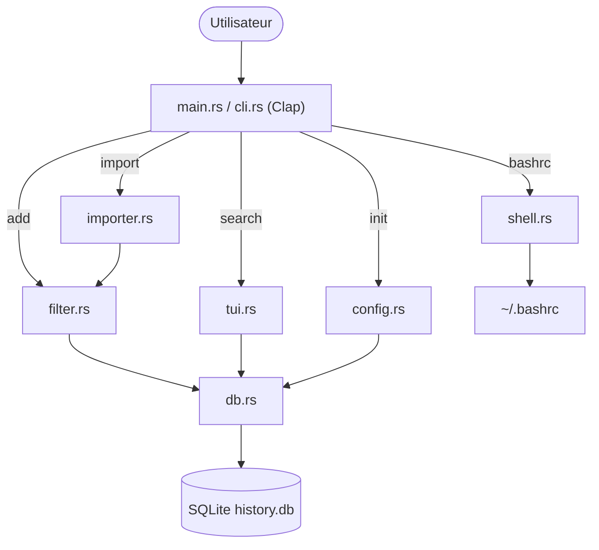
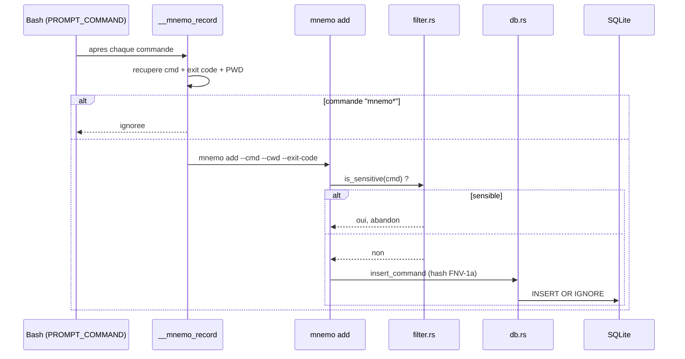
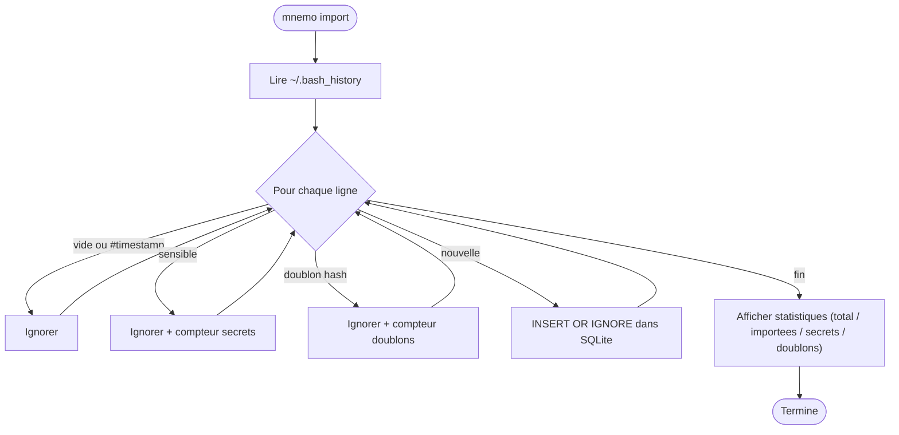
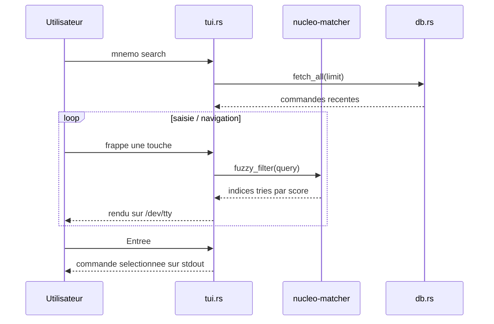
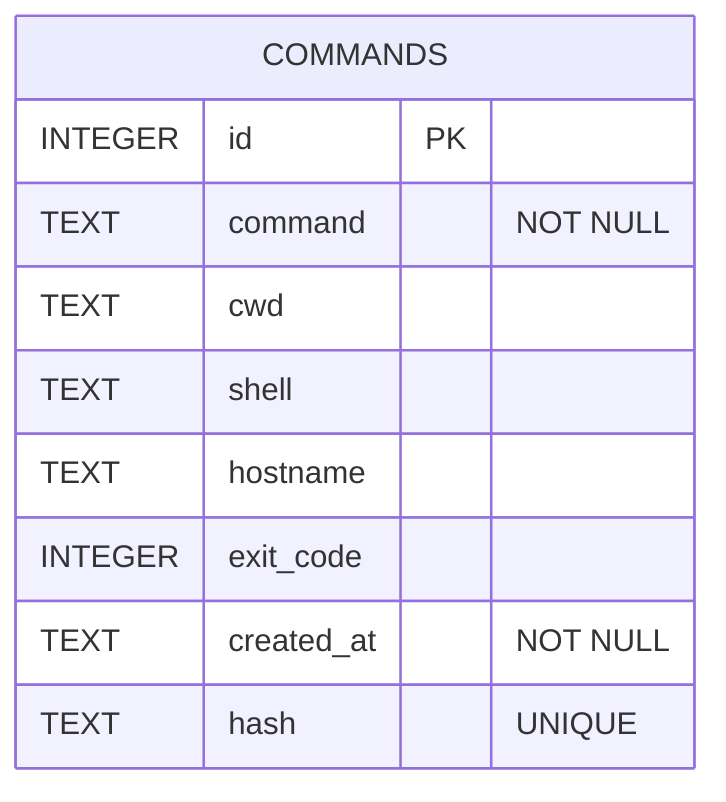
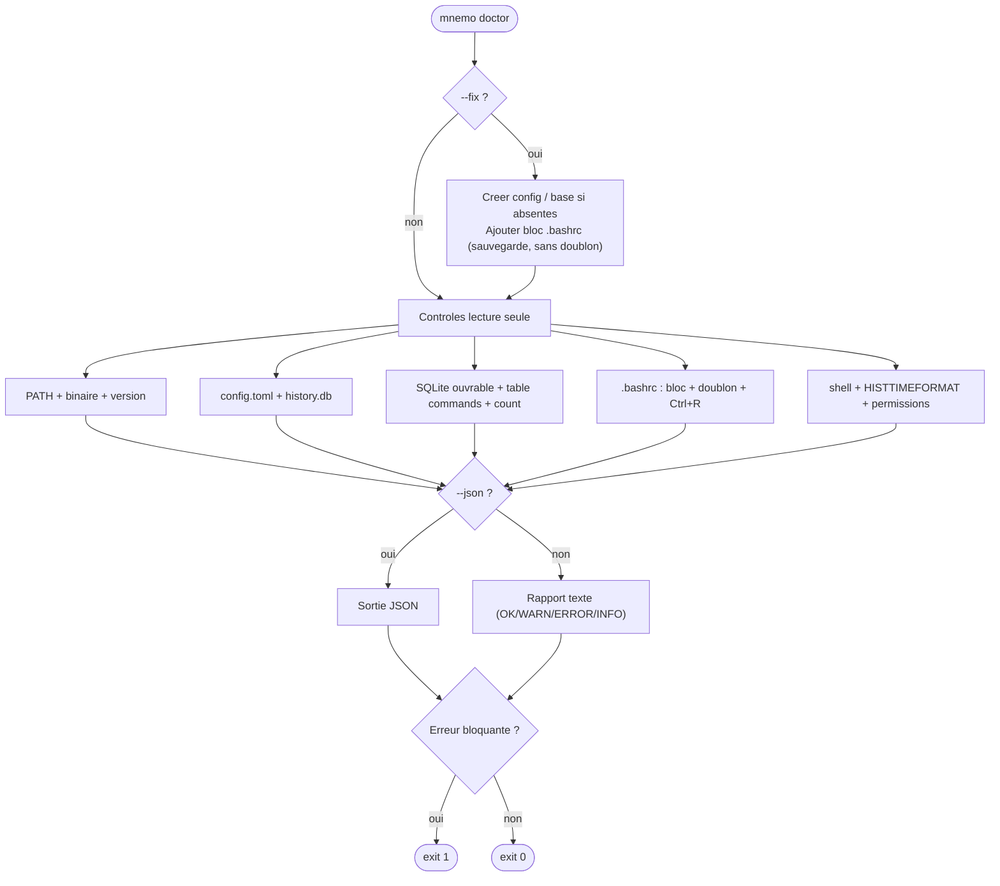

# mnemo

[](https://github.com/Vesperis-group/mnemo/actions/workflows/ci.yml)
[](https://github.com/Vesperis-group/mnemo/actions/workflows/release.yml)

> Dépôt officiel : <https://github.com/Vesperis-group/mnemo>

> Navigation et recherche **fuzzy** dans l'historique Bash — un outil maison en
> **Rust** (CLI + TUI), **local-first**, sans serveur ni cloud.

`mnemo` est une alternative personnelle et minimaliste à Atuin / HSTR /
fzf-history. Chaque commande exécutée est enregistrée dans une base **SQLite**
locale, puis retrouvée instantanément via une interface TUI ou en ligne de
commande.

- 🦀 Rust stable, un seul binaire `mnemo` (~2,3 Mo)
- 🔍 Recherche **fuzzy** interactive (`ratatui` + `crossterm` + `nucleo-matcher`)
- 🗄️ Stockage **SQLite** local (`rusqlite`), aucun réseau
- 🔒 Filtrage automatique des commandes sensibles
- 🐧 Cible : **Linux / WSL** avec Bash
- 🤖 Mode non interactif `--print` pour scripts et CI

> Le code est entièrement réécrit. Atuin, HSTR et fzf n'ont servi que
> d'inspiration fonctionnelle et UX ; aucun code tiers n'a été copié.

---

## Sommaire

- [Aperçu / exemple d'usage](#aperçu--exemple-dusage)
- [Installation rapide](#installation-rapide)
- [Installation manuelle](#installation-manuelle)
- [Désinstallation](#désinstallation)
- [Commandes disponibles](#commandes-disponibles)
- [Version : `mnemo version`](#version--mnemo-version)
- [Intégration Bash](#intégration-bash)
- [Diagnostic : `mnemo doctor`](#diagnostic--mnemo-doctor)
- [Release v0.1](#release-v01)
- [Politique de branche](#politique-de-branche)
- [Pre-commit hooks (à venir)](#pre-commit-hooks-à-venir)
- [Chemins XDG utilisés](#chemins-xdg-utilisés)
- [Sécurité & confidentialité](#sécurité--confidentialité)
- [Architecture & diagrammes](#architecture--diagrammes)
- [Limites du MVP](#limites-du-mvp)
- [Roadmap](#roadmap)
- [Troubleshooting](#troubleshooting)
- [Développement](#développement)
- [Licence](#licence)

---

## Aperçu / exemple d'usage

Interface TUI (`mnemo search`) :

```text
┌ mnemo — recherche ──────────────────────────────────┐
│ cargo                                                │
└──────────────────────────────────────────────────────┘
┌ 3 résultat(s) ───────────────────────────────────────┐
│> 2026-06-13 10:21  ~/mnemo  cargo build --release     │
│  2026-06-13 10:19  ~/mnemo  cargo test                │
│  2026-06-13 10:18  ~/mnemo  cargo clippy              │
└──────────────────────────────────────────────────────┘
 ↑/↓ naviguer   Entrée sélectionner   Esc/Ctrl+C quitter
```

Mode non interactif (scripts / CI) :

```console
$ mnemo search cargo --print
cargo build --release
cargo test
cargo clippy
```

Touches de la TUI :

| Touche | Action |
| --- | --- |
| *(saisie)* | filtre fuzzy en temps réel |
| `↑` / `↓` | navigation dans la liste |
| `Entrée` | imprime la commande sélectionnée sur stdout |
| `Esc` / `Ctrl+C` | quitte sans rien imprimer |

---

## Installation rapide

### Locale (recommandée)

```bash
git clone https://github.com/Vesperis-group/mnemo.git
cd mnemo
bash scripts/install.sh
```

Le script :

1. compile en release (`cargo build --release`) ;
2. installe le binaire dans `~/.local/bin/mnemo` (créé si absent) ;
3. vérifie que `~/.local/bin` est dans le `PATH` ;
4. lance `mnemo init` ;
5. **propose** d'ajouter l'intégration Bash à `~/.bashrc` (avec sauvegarde et
   anti-doublon) ;
6. affiche un résumé des prochaines étapes.

Mode non interactif (utile en CI) :

```bash
MNEMO_ASSUME_YES=1 bash scripts/install.sh   # confirme automatiquement
MNEMO_NO_BASHRC=1  bash scripts/install.sh   # n'ajoute pas le bloc .bashrc
```

### Distante

Installation en une ligne depuis le dépôt officiel :

```bash
curl -fsSL https://raw.githubusercontent.com/Vesperis-group/mnemo/main/scripts/install.sh | bash
```

Le script `install.sh` détecte automatiquement le contexte :

- **mode local** : lancé depuis un dépôt cloné, il compile les sources présentes ;
- **mode distant** : lancé via `curl ... | bash`, il clone le dépôt indiqué par
  la variable `MNEMO_REPO_URL` puis compile.

```bash
# Fixer explicitement le dépôt à cloner en mode distant :
MNEMO_REPO_URL="https://github.com/Vesperis-group/mnemo.git" \
  curl -fsSL https://raw.githubusercontent.com/Vesperis-group/mnemo/main/scripts/install.sh | bash
```

> ℹ️ Par défaut, `MNEMO_REPO_URL` pointe vers un placeholder
> (`https://github.com/REPLACE_ME/mnemo`) afin d'éviter tout clonage involontaire.
> En production, définissez explicitement
> `MNEMO_REPO_URL="https://github.com/Vesperis-group/mnemo.git"`.
> N'exécutez jamais un script distant sans avoir vérifié son contenu au préalable.

---

## Installation manuelle

Si vous préférez tout contrôler :

```bash
# 1. Compiler
cargo build --release

# 2. Installer le binaire
mkdir -p ~/.local/bin
install -m 0755 target/release/mnemo ~/.local/bin/mnemo

# 3. S'assurer que ~/.local/bin est dans le PATH (si nécessaire)
echo 'export PATH="$HOME/.local/bin:$PATH"' >> ~/.bashrc

# 4. Initialiser config + base
mnemo init

# 5. Copier le snippet d'intégration affiché par :
mnemo bashrc
# ... et le coller dans ~/.bashrc, puis :
source ~/.bashrc
```

Avec le `Makefile` :

```bash
make release     # compilation optimisée
make install     # délègue à scripts/install.sh
```

---

## Désinstallation

```bash
bash scripts/uninstall.sh
```

Le script :

1. supprime `~/.local/bin/mnemo` s'il existe ;
2. **propose** de retirer le bloc mnemo de `~/.bashrc` (après sauvegarde) ;
3. **propose** de supprimer les données locales (`~/.config/mnemo`,
   `~/.local/share/mnemo`).

> 🔒 Les données ne sont **jamais** supprimées sans confirmation explicite.

Options :

```bash
MNEMO_ASSUME_YES=1 bash scripts/uninstall.sh   # confirme bin + .bashrc (PAS les données)
MNEMO_PURGE=1      bash scripts/uninstall.sh   # supprime aussi les données
```

Ou via le `Makefile` :

```bash
make uninstall
```

---

## Commandes disponibles

| Commande | Description |
| --- | --- |
| `mnemo init` | Crée `~/.config/mnemo/config.toml`, `~/.local/share/mnemo/history.db` et affiche le snippet `.bashrc`. |
| `mnemo import [--file <chemin>]` | Importe `~/.bash_history` (ou un fichier donné) dans SQLite. |
| `mnemo add --cmd "<cmd>" [--cwd "<dir>"] [--exit-code <n>]` | Ajoute une commande dans la base. |
| `mnemo search [requête]` | Ouvre la TUI interactive ; la commande choisie est imprimée sur stdout. |
| `mnemo search <requête> --print [--limit N]` | **Mode non interactif** : imprime les résultats sur stdout, sans TUI. |
| `mnemo search --query <requête> --print` | Variante avec option explicite `--query`. |
| `mnemo bashrc` | Affiche uniquement le snippet d'intégration Bash. |
| `mnemo doctor [--fix] [--json]` | Diagnostique l'installation et, avec `--fix`, répare les éléments manquants. |
| `mnemo version` | Affiche la version, la cible (OS/arch), le profil de build et le chemin du binaire. |

Le mode `--print` garde le comportement TUI **par défaut** (sans `--print`).

---

## Version : `mnemo version`

La commande `mnemo version` donne un aperçu complet du binaire en cours
d'exécution, pratique pour les rapports de bug et la vérification d'installation :

```console
$ mnemo version
mnemo 0.1.0
  cible   : linux/x86_64
  profil  : release
  binaire : /home/<user>/.local/bin/mnemo
```

| Champ | Source |
| --- | --- |
| version | `CARGO_PKG_VERSION` (champ `version` du `Cargo.toml`) |
| cible | `std::env::consts::OS` / `std::env::consts::ARCH` |
| profil | `debug` ou `release` (`cfg!(debug_assertions)`) |
| binaire | `std::env::current_exe()` |

---

## Intégration Bash

`mnemo init` (ou `mnemo bashrc`) fournit le bloc à coller dans `~/.bashrc`.
`scripts/install.sh` peut l'ajouter automatiquement, encadré par :

```bash
# >>> mnemo init >>>
...   # snippet généré par `mnemo bashrc`
# <<< mnemo init <<<
```

Le snippet :

- branche `__mnemo_record` sur `PROMPT_COMMAND` pour enregistrer chaque commande
  (avec son code de sortie et le répertoire courant) ;
- **n'enregistre jamais** la commande `mnemo` elle-même ;
- remappe `Ctrl+R` pour ouvrir la recherche TUI et insérer la commande choisie.
  La TUI s'affiche sur `/dev/tty`, donc elle fonctionne même dans une
  substitution `$(mnemo search)`.

Après ajout :

```bash
source ~/.bashrc
mnemo import
mnemo search
```

---

## Diagnostic : `mnemo doctor`

`mnemo doctor` inspecte l'installation locale et affiche un rapport clair. En
mode simple, **il ne modifie jamais le système**.

```bash
mnemo doctor          # diagnostic (lecture seule)
mnemo doctor --fix    # répare les éléments manquants (non destructif)
mnemo doctor --json   # sortie JSON exploitable (scripts / CI)
```

### Contrôles effectués

- Binaire `mnemo` trouvable dans le `PATH` (+ chemin détecté) et version.
- `~/.local/bin` présent dans le `PATH`.
- Présence de `~/.config/mnemo/config.toml` et `~/.local/share/mnemo/history.db`.
- Base SQLite ouvrable, table `commands` présente, nombre de commandes.
- Présence de `~/.bashrc`, du bloc mnemo (non dupliqué) et du bind `Ctrl+R`.
- Shell courant (`$SHELL`) — avertissement si ce n'est pas Bash.
- `HISTTIMEFORMAT` — information si non configuré.
- Permissions simples de la config et de la base.

### Statuts et code retour

Chaque ligne porte un statut `[OK]`, `[WARN]`, `[ERROR]` ou `[INFO]`.

| Code retour | Signification |
| --- | --- |
| `0` | Tout est OK ou seulement des avertissements. |
| `1` | Au moins une **erreur bloquante** (ex. base corrompue, table absente). |

### Mode `--fix`

`mnemo doctor --fix` :

- crée la config si absente ;
- crée la base si absente ;
- ajoute le bloc mnemo au `.bashrc` si absent (**avec sauvegarde**, sans
  doublon) ;
- affiche un message clair si `~/.local/bin` n'est pas dans le `PATH` ;
- **ne supprime jamais** de données.

### Exemple de sortie

```text
mnemo doctor — rapport de diagnostic
------------------------------------
[INFO ] mnemo version 0.1.0
[ OK  ] Binaire trouvé dans le PATH : ~/.local/bin/mnemo
[ OK  ] ~/.local/bin est dans le PATH
[ OK  ] Configuration présente : ~/.config/mnemo/config.toml
[ OK  ] Permissions correctes (644)
[ OK  ] Base présente : ~/.local/share/mnemo/history.db
[ OK  ] Table `commands` présente
[INFO ] 128 commande(s) enregistrée(s)
[ OK  ] ~/.bashrc présent
[ OK  ] Bloc d'intégration mnemo présent
[ OK  ] Bloc mnemo unique
[ OK  ] Raccourci Ctrl+R configuré
[ OK  ] Shell courant : /bin/bash
[INFO ] HISTTIMEFORMAT non configuré : les horodatages d'import seront approximatifs
------------------------------------
Résumé : 11 OK, 0 WARN, 0 ERROR, 2 INFO
État global : sain (code 0)
```

Sortie JSON (`--json`) :

```json
{
  "summary": { "ok": 11, "warn": 0, "error": 0, "info": 2, "exit_code": 0 },
  "checks": [
    { "name": "binary.version", "status": "info", "message": "mnemo version 0.1.0" },
    { "name": "db.table", "status": "ok", "message": "Table `commands` présente" }
  ]
}
```

Le JSON est produit via `serde_json` (sérialisation robuste, échappement correct
des caractères spéciaux).

---

## Release v0.1

Le projet est outillé pour une release GitHub **automatisée et versionnée** via
[`release-it`](https://github.com/release-it/release-it). `Cargo.toml` reste la
**source de vérité** de la version Rust.

### Intégration continue (`.github/workflows/ci.yml`)

À chaque `push` / `pull_request` sur `main` :

- `cargo fmt --all -- --check` (formatage) ;
- `cargo clippy --all-targets --all-features -- -D warnings` (lint strict) ;
- `cargo test` (suite de tests) ;
- `cargo build --release` (build de release) ;
- `bash -n` sur `scripts/install.sh`, `scripts/uninstall.sh`,
  `scripts/lib/bashrc.sh`, `scripts/package-release.sh` (vérification de syntaxe).

### Release automatique (`.github/workflows/release.yml`)

Déclenchée par un **push sur `main`** (typiquement le merge d'une PR), elle :

1. exécute le quality gate complet (fmt, clippy, test, build, `bash -n`) ;
2. lance `release-it`, qui :
   - lit la version courante depuis `Cargo.toml` (plugin `@release-it/bumper`) ;
   - calcule l'incrément à partir des *Conventional Commits*
     (`@release-it/conventional-changelog`) et écrit la nouvelle version dans
     `Cargo.toml` ;
   - met à jour `CHANGELOG.md` ;
   - recompile (`cargo build --release`) puis construit l'archive
     `mnemo-linux-x86_64.tar.gz` + `.sha256` via `scripts/package-release.sh` ;
   - commit (`chore: release v${version} [skip ci]`), crée le tag `v${version}`,
     pousse, et publie la **GitHub Release** avec les artefacts.

> 🔁 **Anti-boucle** : le commit de release contient `[skip ci]`, que GitHub
> ignore nativement pour les évènements `push`/`pull_request`. Le workflow a en
> plus une condition `if` de double sécurité.

L'outillage `release-it` ne publie **jamais** sur npm (`npm.publish: false`). Le
`package.json` est `private` et sert uniquement à fournir l'outil de release.

### Déclencher une release

Le flux normal est : **branche → PR → merge dans `main`** → la release part toute
seule. Manuellement (dry-run local pour vérifier) :

```bash
npm ci
npm run release:dry      # simulation, n'écrit/ne pousse rien
```

Pour figer explicitement une première version (au lieu de l'incrément calculé) :

```bash
npx release-it 0.1.0 --ci --config release-it.json
```

### Jeton de publication et branche protégée

Si `main` est protégée, le `GITHUB_TOKEN` par défaut peut être **bloqué** pour
pousser le commit de release. Deux options (voir
[Politique de branche](#politique-de-branche)) :

- **A.** autoriser le contournement de la protection pour le bot de release
  uniquement (Rulesets → *Bypass list*) ;
- **B.** créer un PAT dédié `RELEASE_TOKEN` (scope `repo`) en *secret* du dépôt.
  Le workflow l'utilise automatiquement s'il existe
  (`secrets.RELEASE_TOKEN || secrets.GITHUB_TOKEN`).

---

## Politique de branche

Le développement direct sur `main` est **interdit par convention** : toute
modification passe par une **branche dédiée** puis une **Pull Request**.

Le workflow `.github/workflows/branch-policy.yml` fournit un garde-fou
*best-effort* (rappel/échec côté CI), mais **la vraie protection doit être
activée dans GitHub** :

`Settings → Rules → Rulesets` (ou `Settings → Branches → Branch protection`) sur
la cible `main` :

- ✅ **Require a pull request before merging** ;
- ✅ **Require status checks to pass** (sélectionner les checks `CI`) ;
- ✅ **Require branches to be up to date before merging** (si souhaité) ;
- ✅ **Restrict who can push to matching branches** ;
- ✅ **Include administrators** (si souhaité).

> ⚠️ **Ne pas bloquer le bot de release.** Si `release-it` doit pousser le commit
> et le tag de release, ajoutez l'acteur (`github-actions[bot]` ou le compte du
> `RELEASE_TOKEN`) à la *bypass list* du ruleset, ou utilisez l'option B
> (`RELEASE_TOKEN`). Sinon le push de release échouera sur une branche protégée.

---

## Pre-commit hooks (à venir)

Une configuration [`pre-commit`](https://pre-commit.com/) **optionnelle** est
fournie (`.pre-commit-config.yaml`). Elle n'est **pas** imposée automatiquement.

Activation manuelle, quand vous le souhaiterez :

```bash
pipx install pre-commit
pre-commit install
pre-commit run --all-files
```

Hooks prévus : nettoyage des espaces en fin de ligne, *end-of-file-fixer*,
vérification YAML/TOML, normalisation des fins de ligne, `cargo fmt`,
`cargo clippy`, et `cargo test` (au `pre-push`). `shellcheck` pourra être ajouté
plus tard s'il est installé.

---

## Chemins XDG utilisés

`mnemo` respecte la spécification **XDG Base Directory** (via la crate `dirs`).

| Donnée | Variable XDG | Chemin par défaut |
| --- | --- | --- |
| Configuration | `$XDG_CONFIG_HOME` | `~/.config/mnemo/config.toml` |
| Base SQLite | `$XDG_DATA_HOME` | `~/.local/share/mnemo/history.db` |
| Binaire | — | `~/.local/bin/mnemo` |

Exemple de `config.toml` :

```toml
sensitive_keywords = [
    "password", "passwd", "token", "secret",
    "api_key", "bearer", "private_key", "sshpass",
]
ignore_prefixes = ["mnemo"]
search_limit = 5000
```

- `sensitive_keywords` : une commande contenant l'un de ces mots (insensible à
  la casse) n'est **pas** enregistrée.
- `ignore_prefixes` : préfixes de commandes à ne jamais enregistrer.
- `search_limit` : nombre maximal de commandes chargées dans la TUI.

---

## Sécurité & confidentialité

- **100 % local.** Aucune donnée ne quitte la machine : pas de serveur, pas de
  synchronisation cloud, aucun appel réseau.
- **Filtrage des secrets.** Toute commande contenant `password`, `passwd`,
  `token`, `secret`, `api_key`, `bearer`, `private_key` ou `sshpass` est
  ignorée à l'import comme à l'ajout. La liste est personnalisable.
- **Auto-exclusion.** Les commandes commençant par `mnemo` ne sont pas
  enregistrées (évite de polluer l'historique).
- **Pas de modification destructive sans sauvegarde.** Les scripts
  d'installation/désinstallation sauvegardent `~/.bashrc` avant toute
  modification (`~/.bashrc.mnemo.bak.YYYYMMDD-HHMMSS`) et ne suppriment jamais
  les données sans confirmation.
- **Permissions.** La base reste dans votre répertoire utilisateur. Pensez à la
  protéger si votre historique contient des informations sensibles
  (`chmod 600 ~/.local/share/mnemo/history.db`).

> ℹ️ Le filtrage par mots-clés est une protection « best-effort », pas une
> garantie absolue. Vérifiez votre historique si vous manipulez des secrets.

---

## Architecture & diagrammes

### Modules

```text
src/
├── main.rs       # point d'entrée + dispatch CLI
├── cli.rs        # définitions Clap
├── config.rs     # chemins XDG + chargement/écriture TOML
├── db.rs         # schéma SQLite, insert, search, hash, horodatage
├── importer.rs   # import de ~/.bash_history
├── filter.rs     # détection des commandes sensibles
├── doctor.rs     # diagnostic de l'installation (mnemo doctor)
├── version.rs    # informations de version/build (mnemo version)
├── tui.rs        # interface Ratatui + filtre fuzzy partagé
└── shell.rs      # génération du snippet Bash + helpers .bashrc
scripts/
├── install.sh         # installation (locale ou distante)
├── uninstall.sh       # désinstallation
├── package-release.sh # construction de l'archive de release
└── lib/bashrc.sh      # logique .bashrc partagée (et testée)
```

### Architecture globale



### Flux : enregistrement d'une commande Bash vers SQLite



### Flux : import de `~/.bash_history`



### Flux : recherche TUI



### Schéma simplifié de la base SQLite



Le dédoublonnage repose sur `hash` (FNV-1a 64 bits sur `command` + `cwd`) avec
contrainte `UNIQUE` et `INSERT OR IGNORE`.

### Cycle d'installation


### Flux : diagnostic `mnemo doctor`



---

## Limites du MVP

- Pas d'horodatage par commande à l'import : toutes les lignes de
  `.bash_history` reçoivent l'heure de l'import (Bash ne stocke les dates que si
  `HISTTIMEFORMAT` est actif).
- Recherche fuzzy en mémoire (chargement jusqu'à `search_limit`, 5000 par
  défaut) — pas de pagination côté base.
- Bash uniquement (pas de Zsh/Fish), pas de recherche plein-texte SQLite (FTS),
  pas de filtre par `cwd` / code de sortie dans la TUI.
- Hash de dédoublonnage non cryptographique (FNV-1a) — adapté au dédoublonnage,
  pas à la sécurité.

---

## Roadmap

- [x] Commande `mnemo doctor` (diagnostic, `--fix`, `--json`).
- [ ] Timestamps réels par commande (capture dans le hook Bash).
- [ ] Filtres TUI : par répertoire, code de sortie, plage de dates.
- [ ] Aperçu multi-lignes et coloration syntaxique dans la TUI.
- [ ] Commande `mnemo stats` (commandes les plus fréquentes, etc.).
- [ ] Édition / suppression d'entrées, export JSON/CSV.
- [ ] Support Zsh / Fish.
- [ ] FTS5 SQLite pour de très gros historiques.
- [ ] Chiffrement optionnel de la base (post-MVP, toujours local).

---

## Troubleshooting

> 💡 En cas de doute, lancez d'abord `mnemo doctor` : il identifie la plupart
> des problèmes ci-dessous, et `mnemo doctor --fix` en répare beaucoup
> automatiquement (sans rien supprimer).

**`mnemo: command not found` après installation**
`~/.local/bin` n'est pas dans le `PATH`. Ajoutez à `~/.bashrc` :
```bash
export PATH="$HOME/.local/bin:$PATH"
```
puis `source ~/.bashrc`.

**`Aucune commande enregistrée. Lancez mnemo import d'abord.`**
La base est vide. Lancez `mnemo import` ou exécutez quelques commandes après
avoir activé l'intégration Bash.

**Les nouvelles commandes ne sont pas enregistrées**
Vérifiez que le bloc mnemo est présent dans `~/.bashrc` (`mnemo bashrc` pour le
voir) et que vous avez rechargé le shell (`source ~/.bashrc`). Vérifiez aussi
que `PROMPT_COMMAND` contient `__mnemo_record` :
```bash
echo "$PROMPT_COMMAND"
```

**`Ctrl+R` n'ouvre pas mnemo**
Le `bind -x` nécessite un shell interactif. Assurez-vous que le bloc est chargé
et qu'aucun autre outil (fzf, Atuin…) ne capture déjà `Ctrl+R` après mnemo.

**La TUI ne s'affiche pas / `/dev/tty` indisponible**
La recherche interactive requiert un vrai terminal. En CI ou via un pipe,
utilisez le mode non interactif : `mnemo search <requête> --print`.

**Une commande sensible a été enregistrée**
Ajoutez le mot-clé manquant dans `sensitive_keywords` de
`~/.config/mnemo/config.toml`, puis ré-importez si besoin.

**Erreur de compilation liée à SQLite**
La crate `rusqlite` est compilée avec SQLite embarqué (`bundled`). Un compilateur
C est requis (`build-essential` sous Debian/Ubuntu).

**Diagnostiquer rapidement l'état de l'installation**
```bash
mnemo doctor          # rapport lisible
mnemo doctor --json   # pour un script
mnemo doctor --fix    # répare config / base / bloc .bashrc (non destructif)
```
Un code retour `1` indique une erreur bloquante (ex. base corrompue) ; `0`
signifie sain ou simples avertissements.

---

## Développement

```bash
make build      # cargo build
make release    # cargo build --release
make test       # cargo test (unitaires + intégration scripts/CLI)
make lint       # cargo fmt --check + clippy -D warnings
make fmt        # cargo fmt
make clean      # cargo clean
make help       # liste des cibles
```

Qualité visée (toutes vertes) :

```bash
cargo fmt
cargo clippy --all-targets --all-features -- -D warnings
cargo test
cargo build --release
bash -n scripts/install.sh
bash -n scripts/uninstall.sh
```

Couverture des tests :

- filtre des secrets (`filter`) ;
- hash / dédoublonnage / insertion / horodatage SQLite (`db`) ;
- import `.bash_history` (`importer`) ;
- mode `--print` non interactif (`tui` + `tests/cli.rs`) ;
- diagnostic `doctor` : HOME sain, config/base absente, base corrompue,
  `--fix`, `--json`, codes retour (`tests/doctor.rs`) ;
- syntaxe des scripts (`bash -n`), idempotence et sauvegarde du `.bashrc`
  (`tests/scripts.rs`).

---

## Licence

MIT.
